# 🎵 Audio Tour App — Product Requirements Document (PRD)

> **Nền tảng:** .NET MAUI 10.0 (Android / iOS)

| Trường | Nội dung |
|--------|----------|
| **Môn học** | Đồ án C# |
| **Framework** | .NET MAUI 10.0 — Android & iOS |

---

## 📋 Mục lục

- [1. Tổng quan Dự án](#1-tổng-quan-dự-án)
- [2. Kiến trúc Hệ thống Tổng quan](#2-kiến-trúc-hệ-thống-tổng-quan)
- [3. Geofence Engine & Narration Engine](#3-geofence-engine--narration-engine)
- [4. Hệ thống App Người dùng (Mobile App)](#4-hệ-thống-app-người-dùng-mobile-app)
- [5. Chiến lược Đồng bộ & Offline-First *(MỚI)*](#5-chiến-lược-đồng-bộ--offline-first)
- [6. Hệ thống Admin — CMS Web](#6-hệ-thống-admin--cms-web)
- [7. Thiết kế Cơ sở Dữ liệu](#7-thiết-kế-cơ-sở-dữ-liệu)
- [8. Thiết kế REST API](#8-thiết-kế-rest-api)
- [9. Yêu cầu Phi chức năng](#9-yêu-cầu-phi-chức-năng)
- [10. Kiến trúc Triển khai & Môi trường *(MỚI)*](#10-kiến-trúc-triển-khai--môi-trường)
- [11. Kế hoạch Triển khai & Lộ trình](#11-kế-hoạch-triển-khai--lộ-trình)
- [12. Rủi ro & Giải pháp Dự phòng](#12-rủi-ro--giải-pháp-dự-phòng)
- [13. Phụ lục](#13-phụ-lục)

---

## 1. Tổng quan Dự án

### 1.1 Mô tả sản phẩm

**Audio Tour App** là ứng dụng di động hướng dẫn thuyết minh tự động cho khách tham quan, du lịch. Dựa trên vị trí GPS của người dùng, ứng dụng tự động kích hoạt nội dung âm thanh (TTS hoặc file thu sẵn) khi người dùng tiếp cận các điểm tham quan (**Point of Interest - POI**) được định nghĩa sẵn.

Ứng dụng hướng tới việc số hóa trải nghiệm tham quan, thay thế tour guide truyền thống bằng công nghệ định vị và âm thanh hiện đại, phù hợp với nhu cầu du lịch tự do và các tuyến di sản văn hóa đô thị.

### 1.2 Mục tiêu

- Cung cấp trải nghiệm thuyết minh tự động, không cần kết nối mạng (**offline-first**)
- Hỗ trợ đa ngôn ngữ (Tiếng Việt, Tiếng Anh, tiếng khác qua TTS)
- Tích hợp QR code để kích hoạt nội dung tại các điểm dừng xe buýt, bảng thông tin
- Cung cấp hệ thống CMS cho Admin quản lý nội dung linh hoạt
- Thu thập dữ liệu phân tích ẩn danh để cải thiện trải nghiệm

### 1.3 Phạm vi & Đối tượng

| Hạng mục | Chi tiết |
|----------|----------|
| Đối tượng chính | Du khách tham quan khu di sản, phường Khánh Hội, TP.HCM |
| Platform | Android (API 26+) & iOS (14+) — .NET MAUI 8.0 |
| Backend | ASP.NET Core Web API + SQLite/SQL Server + File Storage |
| Admin CMS | ASP.NET Core MVC — Quản lý POI, Audio, Analytics |
| Địa lý PoC | Các phường Khánh Hội, Quận 4, TP.HCM (giai đoạn đầu) |

---

## 2. Kiến trúc Hệ thống Tổng quan

### 2.1 Sơ đồ kiến trúc tổng quát

Hệ thống gồm 3 thành phần chính: **Mobile App** (người dùng cuối), **Backend API**, và **Admin Web CMS**.

```
┌─────────────────────────────────────────────────────────────────────┐
│                    KIẾN TRÚC HỆ THỐNG TỔNG QUAN                     │
├─────────────────────┬──────────────────────┬────────────────────────┤
│   MOBILE APP (MAUI) │   BACKEND / API      │   ADMIN WEB (CMS)      │
├─────────────────────┼──────────────────────┼────────────────────────┤
│ • GPS Tracking      │ • REST API (ASP.NET) │ • Quản lý POI          │
│ • Geofence Engine   │ • Authentication     │ • Quản lý Audio        │
│ • Narration Engine  │ • POI Management     │ • Analytics Dashboard  │
│ • Map View          │ • Analytics Service  │ • Báo cáo & Thống kê   │
│ • Offline SQLite    │ • File Storage       │ • Quản lý người dùng   │
│ • QR Scanner        │ • Push Notification  │ • QR Code Generator    │
├─────────────────────┴──────────────────────┴────────────────────────┤
│                         DATABASE LAYER                               │
│     SQL Server / SQLite          Local / Azure Blob (Audio)         │
└─────────────────────────────────────────────────────────────────────┘
```

### 2.2 Các thành phần kiến trúc

| Thành phần | Công nghệ | Mô tả |
|------------|-----------|-------|
| Mobile App | .NET MAUI 8.0 | Ứng dụng Android/iOS — GPS, Geofence, TTS, Map, QR |
| GPS Service | FusedLocationProvider / MAUI Essentials | Theo dõi vị trí foreground + background service |
| Geofence Engine | Custom C# + Haversine | Xác định POI trong bán kính, debounce & cooldown |
| Narration Engine | Android TTS / Azure Cognitive | Quản lý hàng đợi audio, chọn TTS/file, chống lặp |
| Local DB | SQLite + EF Core | Lưu POI offline, log phát, cache settings |
| Backend API | ASP.NET Core 8 | REST API — CRUD POI, Analytics, Auth, Sync |
| Database | SQL Server / SQLite | Lưu trữ POI, audio metadata, play logs, users |
| File Storage | Local / Azure Blob / CDN | Lưu file audio `.mp3`/`.m4a`, ảnh POI |
| Admin CMS | ASP.NET Core MVC | Quản lý POI, audio, analytics, cài đặt hệ thống |

### 2.3 Luồng hoạt động tổng thể

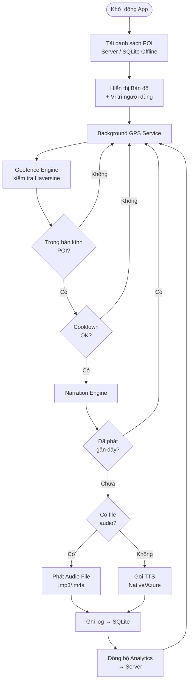

---

## 3. Geofence Engine & Narration Engine

### 3.1 Geofence Engine

Geofence Engine là trái tim của ứng dụng — liên tục so sánh vị trí người dùng với danh sách POI để quyết định khi nào cần phát nội dung.

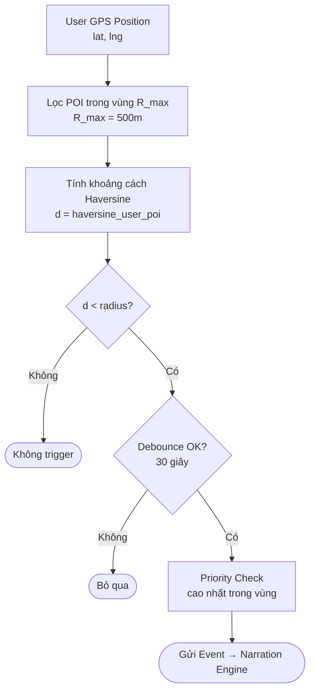

**Thông số kỹ thuật Geofence:**

| Tham số | Giá trị mặc định | Mô tả |
|---------|------------------|-------|
| GPS Update Interval | 5 giây (foreground) | Tần suất cập nhật vị trí khi app ở foreground |
| GPS Update Interval (BG) | 15 giây (background) | Tần suất cập nhật khi app ở background — tiết kiệm pin |
| GPS Accuracy | Medium (100m) | Độ chính xác GPS — cân bằng pin vs chính xác |
| Min Trigger Radius | 20m | Bán kính tối thiểu để trigger |
| Default POI Radius | 50–200m | Bán kính mặc định của POI (admin cấu hình) |
| Debounce Time | 30 giây | Thời gian chờ tối thiểu sau lần trigger đầu tiên |
| Cooldown Per POI | 10 phút | Không phát lại cùng 1 POI trong vòng 10 phút |
| Max POIs in Range | Top 3 | Chỉ xử lý 3 POI gần nhất/ưu tiên cao nhất |
| Distance Formula | Haversine | Tính khoảng cách theo đường cong bề mặt trái đất |

### 3.2 Narration Engine

Narration Engine quản lý toàn bộ vòng đời của audio: nhận sự kiện từ Geofence, quyết định phát TTS hay audio file, quản lý hàng đợi, và ghi log.

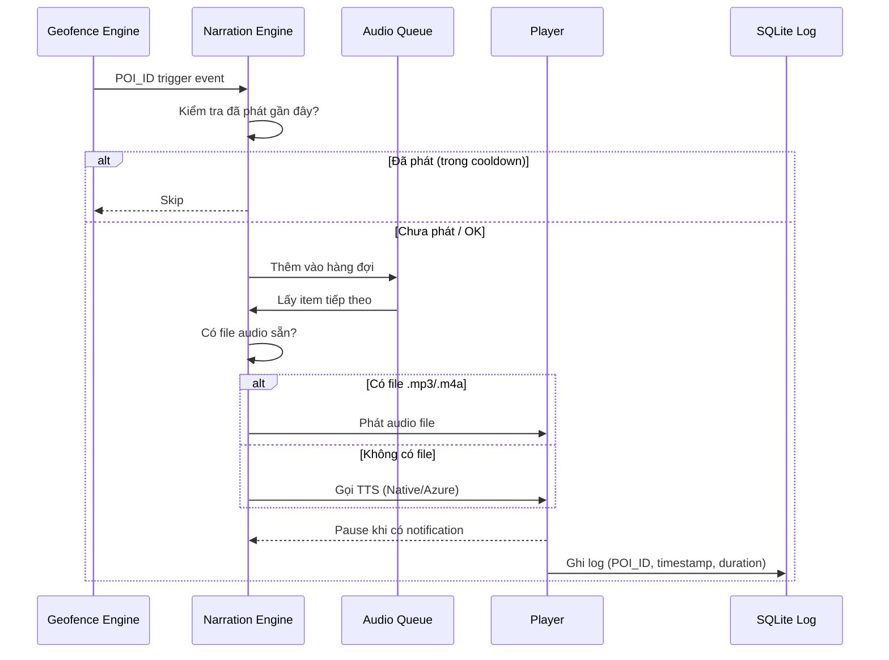

**Trạng thái Narration Engine:**

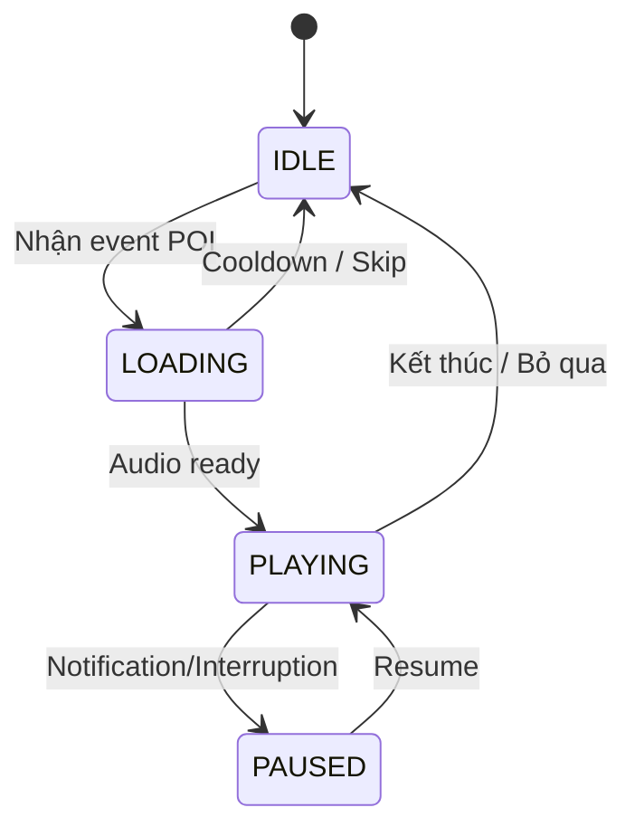

**Ưu tiên phát audio:**

| Ưu tiên | Điều kiện | Hành động |
|---------|-----------|-----------|
| 🔴 1 (Cao nhất) | QR code scan | Phát ngay lập tức, ngắt queue hiện tại |
| 🟠 2 | POI priority cao + đi vào vùng | Thêm vào đầu hàng đợi |
| 🟡 3 | POI thường + đi vào vùng | Thêm vào cuối hàng đợi |
| 🟢 4 (Thấp nhất) | User nhấn thủ công | Phát ngay (override queue) |

---

## 4. Hệ thống App Người dùng (Mobile App)

### 4.1 Kiến trúc Mobile App

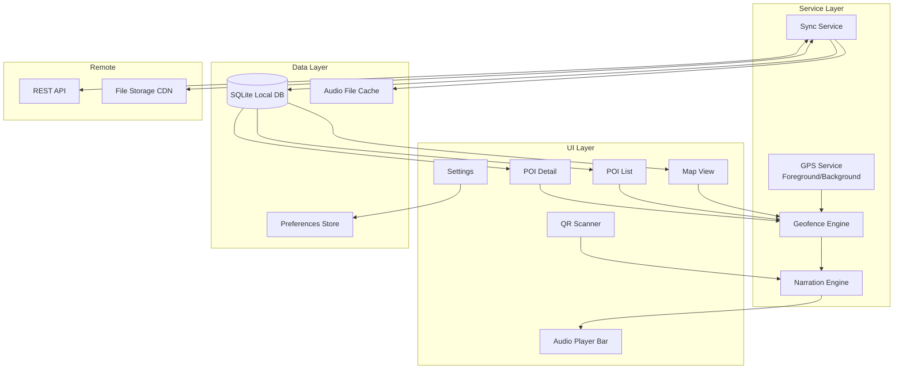

### 4.2 Màn hình & Luồng điều hướng

| Màn hình | Chức năng | Kỹ thuật chính |
|----------|-----------|----------------|
| Splash / Onboarding | Giới thiệu app, xin quyền GPS & Micro | Permissions API (MAUI Essentials) |
| Map View (Home) | Bản đồ + vị trí user + tất cả POI + POI nổi bật | MAUI Maps / Google Maps SDK + Custom pins |
| POI List | Danh sách POI, khoảng cách, trạng thái nghe | CollectionView + SQLite query |
| POI Detail | Ảnh, mô tả, audio player, link bản đồ | ScrollView + MediaElement / AVPlayer |
| Audio Player Bar | Mini player luôn hiển thị phía dưới, control phát/dừng | Overlay UI + MediaElement binding |
| QR Scanner | Quét QR → phát ngay nội dung POI tương ứng | ZXing.Net.MAUI hoặc Camera MAUI |
| **Settings** *(MỚI)* | Chọn ngôn ngữ TTS, tốc độ nói, bán kính, gói offline | Preferences API + local storage |
| **Offline Pack** *(MỚI)* | Tải gói audio + POI để dùng offline | Background download + SQLite sync |

### 4.3 Chức năng GPS Tracking

- **Foreground:** `FusedLocationProviderClient` (Android) / `CLLocationManager` (iOS) — cập nhật mỗi 5 giây
- **Background:** Foreground Service (Android) hiển thị notification liên tục — background location permission (iOS: `Always`)
- **Tối ưu pin:** sử dụng `PRIORITY_BALANCED_POWER_ACCURACY` thay vì `HIGH_ACCURACY`; tăng interval khi không di chuyển
- **Lọc nhiễu:** loại bỏ vị trí có `accuracy > 50m` hoặc speed không hợp lệ
- **Offline GPS:** vẫn hoạt động khi không có mạng — Geofence chỉ cần GPS

### 4.4 Chức năng Map View

- Hiển thị vị trí người dùng real-time (blue dot)
- Hiển thị toàn bộ POI dưới dạng custom marker (icon đặc trưng)
- Highlight POI gần nhất — marker to hơn, màu khác, animation pulse
- Nhấn vào marker → hiển thị popup preview → nhấn tiếp → POI Detail
- Tự động zoom/pan khi người dùng di chuyển đến POI mới
- Hỗ trợ offline map tile (Mapbox / HERE) nếu cần cache bản đồ

### 4.5 Chức năng TTS & Audio

| Tính năng | TTS (Text-to-Speech) | Pre-recorded Audio |
|-----------|---------------------|--------------------|
| Chất lượng giọng | Trung bình (Android native) / Cao (Azure) | Rất cao — giọng người thật |
| Dung lượng | Không tốn — tạo realtime | ~500KB–2MB / file mp3 |
| Offline | Native TTS hoạt động offline | Cần tải trước |
| Đa ngôn ngữ | Tốt (thay locale) | Cần thu âm từng ngôn ngữ |
| **Recommended Use** | POI mới, ngôn ngữ phụ, nội dung động | POI chính, bản ngữ Việt, quan trọng |

### 4.6 Màn hình Cài đặt & Tùy chỉnh *(MỚI)*

| Module | Tùy chọn | Mô tả |
|--------|----------|-------|
| GPS & Bán kính | Độ nhạy GPS: High Accuracy / Battery Saver | Cân bằng giữa chính xác và tiết kiệm pin |
| | Bán kính kích hoạt: 20m / 50m / 100m | Phù hợp tốc độ di chuyển (đi bộ vs xe buýt) |
| | Chu kỳ GPS: 3s / 5s / 10s | Tần suất lấy tọa độ |
| Giọng TTS | Chọn giọng: Nam / Nữ | Tùy TTS engine hỗ trợ |
| | Tốc độ đọc: 0.75x – 1.5x | Chậm / Bình thường / Nhanh |
| | Âm lượng tự động | Tự điều chỉnh volume theo môi trường |
| Gói Offline | Danh sách Tour khả dụng | Hiển thị tour có thể tải trước |
| | Tải / Xóa gói | Download toàn bộ audio + data cho tour chọn |
| | Dung lượng hiển thị | Mỗi gói hiện rõ kích thước (VD: "Tour Ẩm thực Đêm - 45 MB") |
| Ngôn ngữ | Đổi ngôn ngữ | vi / en / ko / zh — re-sync translations khi đổi |
| | Dark Mode | Bản đồ Dark Theme cho di chuyển ban đêm |
| | Thông báo | Bật/tắt notification khi tiến gần POI |

---

## 5. Chiến lược Đồng bộ & Offline-First

### 5.1 Mô hình Offline-First

Mọi dữ liệu POI, audio và bản đồ đều được cache cục bộ trên SQLite & file system, đảm bảo ứng dụng vận hành **100% khi mất kết nối**.

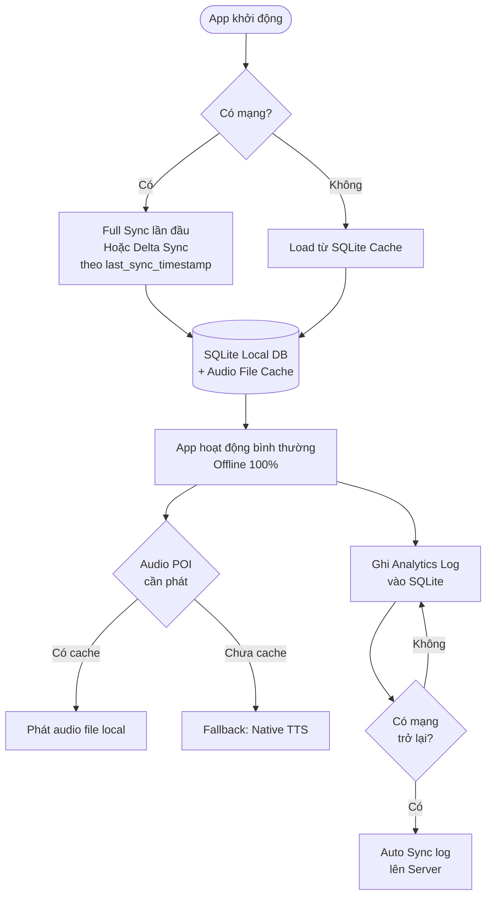

### 5.2 Chi tiết cơ chế đồng bộ

| Cơ chế | Mô tả |
|--------|-------|
| **Full Sync** | Lần đầu mở app: tải toàn bộ danh sách POI + translations + audio files theo ngôn ngữ đã chọn |
| **Delta Sync** | Gửi `last_sync_timestamp` → server chỉ trả về POI mới/cập nhật/xóa kể từ timestamp |
| **Offline Mode** | App dùng 100% SQLite cache. Audio cached phát bình thường. Audio chưa cache → fallback TTS nội bộ |
| **Conflict Resolution** | Server-wins: CMS là nguồn sự thật duy nhất. Server data ghi đè local khi sync |
| **Tải gói Tour** | User chọn Tour → download trước toàn bộ audio pack → dùng offline trọn vẹn |
| **Analytics offline** | Log ghi tạm vào SQLite → auto sync lên server khi có mạng trở lại |
| **Dung lượng ước tính** | ~50MB cho 50 POI (audio + ảnh) |

---

## 6. Hệ thống Admin — CMS Web

### 6.1 Tổng quan Admin System

```
┌──────────────────────────────────────────────────────────┐
│              HỆ THỐNG ADMIN (CMS WEB)                    │
├──────────────────────────────────────────────────────────┤
│  ┌─────────────────────────────────────────────────┐     │
│  │                DASHBOARD                        │     │
│  │  • Thống kê lượt nghe theo ngày/tuần/tháng      │     │
│  │  • Top POI được nghe nhiều nhất                 │     │
│  │  • Heat map vị trí người dùng                   │     │
│  └─────────────────────────────────────────────────┘     │
│                                                          │
│  ┌──────────────┐  ┌────────────┐  ┌────────────────┐   │
│  │  POI Manager │  │Audio Mgmt  │  │  Tour Manager  │   │
│  │  • CRUD POI  │  │• Upload    │  │  • CRUD Tour   │   │
│  │  • Set radius│  │• TTS script│  │  • Gán POI     │   │
│  │  • Set prior.│  │• Đa ngôn   │  │  • Order index │   │
│  │  • QR gen    │  │  ngữ       │  │  • Preview map │   │
│  └──────────────┘  └────────────┘  └────────────────┘   │
│                                                          │
│  ┌────────────────────────┐  ┌────────────────────────┐  │
│  │  Analytics & Reports   │  │  System Settings       │  │
│  │  • Lịch sử di chuyển  │  │  • Cấu hình radius     │  │
│  │  • Thời gian nghe TB  │  │  • Cooldown thời gian  │  │
│  │  • Export CSV/Excel   │  │  • TTS provider        │  │
│  └────────────────────────┘  └────────────────────────┘  │
└──────────────────────────────────────────────────────────┘
```

### 6.2 Phân quyền người dùng Admin

| Quyền | Super Admin | Content Admin | Editor | Viewer |
|-------|:-----------:|:-------------:|:------:|:------:|
| Xem Dashboard | ✅ | ✅ | ✅ | ✅ |
| Quản lý POI | ✅ | ✅ | ✅ (Edit) | ❌ |
| Upload Audio | ✅ | ✅ | ✅ | ❌ |
| Quản lý Tour | ✅ | ✅ | ❌ | ❌ |
| Analytics | ✅ | ✅ | ❌ | ✅ (Xem) |
| Quản lý User | ✅ | ❌ | ❌ | ❌ |
| System Config | ✅ | ❌ | ❌ | ❌ |
| Gen QR Code | ✅ | ✅ | ❌ | ❌ |

### 6.3 Module Quản lý POI

**Form tạo/sửa POI:**

- Tên POI (đa ngôn ngữ: VI, EN, KO, ZH...)
- Tọa độ: lat/lng (có thể pick trên bản đồ trực tiếp)
- Bán kính kích hoạt: 20m – 500m (slider)
- Mức ưu tiên: 1 (thấp) – 5 (cao)
- Trạng thái: `Active` / `Inactive` / `Seasonal`
- Ảnh minh họa: upload PNG/JPG, tự resize
- Mô tả văn bản: rich text editor
- Script TTS: textarea cho từng ngôn ngữ
- File audio: upload `.mp3`/`.m4a`, preview trực tiếp
- Link bản đồ: tự động generate Google Maps URL

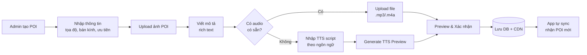

### 6.4 Module Audio Management

- Upload file audio (drag & drop), tự encode sang AAC/MP3 128kbps
- Preview trực tiếp trong trình duyệt
- Quản lý phiên bản: v1, v2 — rollback nếu cần
- Liên kết audio với POI và ngôn ngữ cụ thể
- Tạo TTS preview ngay trên web (Azure/Google Cognitive API)
- Thống kê: số lượt phát, thời gian phát TB, drop-off point

### 6.5 Module Analytics Dashboard

- Bản đồ nhiệt (Heat Map): mật độ người dùng theo khu vực (ẩn danh)
- Top 10 POI được nghe nhiều nhất trong 7/30 ngày
- Thời gian nghe trung bình per POI
- Lượt kích hoạt theo trigger type: GPS / QR / Manual
- Biểu đồ lượt nghe theo giờ/ngày/tuần
- Tỷ lệ hoàn thành audio (% nghe đến cuối)
- Export báo cáo: CSV, Excel

### 6.6 Module Quản lý Tour *(MỚI)*

| Chức năng | Mô tả |
|-----------|-------|
| CRUD Tour | Tạo / Sửa / Xóa lộ trình tham quan (VD: "Tour Ẩm thực Ban Đêm") |
| Gán POI vào Tour | Kéo thả hoặc chọn checkbox POI → sắp xếp thứ tự ghé thăm (`order_index`) |
| Preview tuyến | Xem tuyến tour trên bản đồ mini trong CMS |
| Kích hoạt / Vô hiệu | Toggle trạng thái active cho từng tour |

### 6.7 Module QR Code

- Chọn POI → Generate QR Code PNG/SVG
- In QR với logo, tên điểm, khung viền chuyên nghiệp
- Gán QR → trạm xe buýt cụ thể (VD: Trạm 3, Phường Khánh Hội)
- QR Deep Link: `audiotour://poi/{poi_id}` → mở app và phát ngay
- Theo dõi lượt quét QR trong analytics
- Xuất file kích thước in poster (A4 / A3)

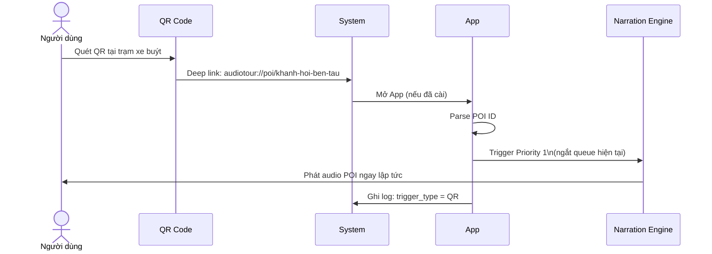

---

## 7. Thiết kế Cơ sở Dữ liệu

### 7.1 ERD Diagram

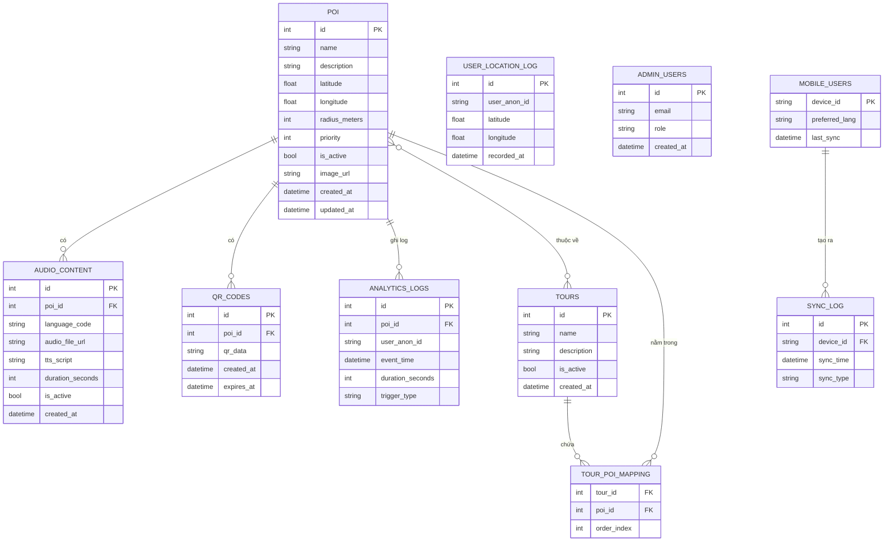

### 7.2 Mô tả bảng dữ liệu

| Bảng | Trường chính | Mô tả |
|------|-------------|-------|
| `poi` | id, lat, lng, radius, priority | Điểm tham quan với tọa độ và thông số geofence |
| `audio_content` | poi_id, language, audio_url | File audio hoặc script TTS theo từng ngôn ngữ |
| `analytics_logs` | poi_id, user_anon_id, event_time | Ghi log mỗi lần phát — analytics + chống lặp |
| `tours` | id, name, is_active | Nhóm các POI thành tuyến tham quan |
| `tour_poi_mapping` | tour_id, poi_id, order_index | Liên kết POI với Tour theo thứ tự |
| `qr_codes` | poi_id, qr_data, expires_at | Dữ liệu QR code, thời gian hết hạn |
| `user_location_log` | user_anon_id, lat, lng | Lịch sử di chuyển ẩn danh cho heat map |
| `admin_users` | id, email, role | Tài khoản admin CMS với phân quyền |
| `mobile_users` | device_id, preferred_lang | Thông tin thiết bị ẩn danh |
| `sync_log` | device_id, sync_time, sync_type | Lịch sử đồng bộ |

---

## 8. Thiết kế REST API

### 8.1 Các endpoint chính

| Method | Endpoint | Mô tả |
|--------|----------|-------|
| `GET` | `/api/v1/pois` | Lấy danh sách tất cả POI active |
| `GET` | `/api/v1/pois/{id}` | Chi tiết một POI kèm audio content |
| `GET` | `/api/v1/pois/nearby?lat=&lng=&radius=` | Tìm POI trong bán kính (Haversine) |
| `POST` | `/api/v1/pois` | [Admin] Tạo POI mới |
| `PUT` | `/api/v1/pois/{id}` | [Admin] Cập nhật POI |
| `DELETE` | `/api/v1/pois/{id}` | [Admin] Xóa / vô hiệu hóa POI |
| `GET` | `/api/v1/audio/{poi_id}?lang=vi` | Lấy file audio URL theo ngôn ngữ |
| `POST` | `/api/v1/audio/upload` | [Admin] Upload file audio (multipart) |
| `POST` | `/api/v1/analytics/play` | Ghi log lượt phát |
| `POST` | `/api/v1/analytics/location` | Ghi log vị trí ẩn danh (batch, mỗi 30s) |
| `GET` | `/api/v1/analytics/dashboard` | [Admin] Dữ liệu dashboard |
| `GET` | `/api/v1/qr/{poi_id}` | Resolve QR deep link |
| `POST` | `/api/v1/qr/generate/{poi_id}` | [Admin] Tạo QR code PNG |
| `GET` | `/api/v1/sync?since=timestamp` | Đồng bộ POI (delta sync) |
| `GET` | `/api/v1/sync/full` | Đồng bộ toàn bộ (full sync) |
| `GET` | `/api/v1/tours` | Danh sách Tour active |
| `GET` | `/api/v1/tours/{id}/pois` | POI trong Tour theo thứ tự |

---

## 9. Yêu cầu Phi chức năng

### 9.1 Hiệu năng

| Tiêu chí | Yêu cầu |
|----------|---------|
| Thời gian khởi động app | ≤ 3 giây (cold start) |
| Thời gian trigger → phát audio | ≤ 2 giây từ khi vào geofence |
| GPS accuracy required | ≤ 20m cho POI radius 50m |
| Pin consumption (background) | ≤ 5% / giờ (background GPS + geofence) |
| API response time | < 500ms (p95) cho endpoint POI list |
| Delta Sync | ≤ 2 giây (Wi-Fi) / ≤ 5 giây (4G) |
| Offline capability | 100% core features hoạt động không cần internet |
| Dung lượng app | < 80MB (base app), gói offline ~50MB/50 POI |

### 9.2 Bảo mật & Quyền riêng tư

- Dữ liệu vị trí: **ẩn danh hoàn toàn** — không liên kết với tài khoản cá nhân
- API Authentication: **JWT Bearer Token** cho Admin endpoints
- **HTTPS bắt buộc** cho mọi kết nối API
- Mật khẩu CMS mã hóa **BCrypt** (salt + hash)
- Dữ liệu GPS không gửi lên server khi offline — ghi tạm SQLite
- GDPR / PDPA compliant: người dùng có thể từ chối thu thập analytics
- SQLite local có thể mã hóa bằng **SQLCipher** (tùy chọn)
- Admin CMS: 2FA cho Super Admin account

### 9.3 Khả năng mở rộng

- Hỗ trợ tối thiểu **500 POI** đồng thời trên bản đồ
- Backend xử lý **≥ 100 request/giây** đồng thời
- Analytics log xử lý **≥ 10,000 bản ghi/ngày**
- Multi-city: thêm địa điểm mới chỉ cần thêm POI — không cần deploy lại app
- Kiến trúc cho phép thêm ngôn ngữ mới **không cần thay đổi code**
- Plugin TTS: dễ dàng thay đổi provider (Azure ↔ Google Cloud TTS)

### 9.4 Khả dụng & Trải nghiệm (UX/Accessibility) *(MỚI)*

- App hoạt động ổn định **offline 100%** (với data đã cache)
- Font size đủ lớn, contrast ratio đạt chuẩn **WCAG AA**
- Hỗ trợ **Screen Reader** (TalkBack/VoiceOver) cho người khiếm thị
- Responsive UI: hỗ trợ màn hình từ **5" đến 10" tablet**

---

## 10. Kiến trúc Triển khai & Môi trường

### 10.1 Sơ đồ Deployment

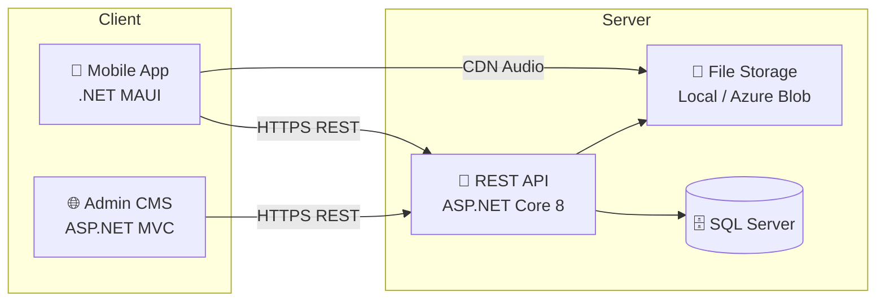

### 10.2 Môi trường

| Môi trường | Mục đích | Database | Ghi chú |
|------------|----------|----------|---------|
| **Development** | Dev cá nhân, debug | SQLite local | Hot reload, debug mode |
| **Staging** | Test tích hợp, UAT | SQL Server (test) | Dữ liệu mẫu, test geofence |
| **Production** | Người dùng thật | SQL Server (prod) | HTTPS, backup hàng ngày |

### 10.3 Quy trình CI/CD

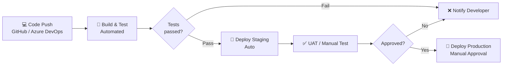

---

## 11. Kế hoạch Triển khai & Lộ trình

### 11.1 Phân chia giai đoạn

| Giai đoạn | Thời gian | Nội dung | Deliverable |
|-----------|-----------|----------|-------------|
| **Phase 1 — POC** | Tuần 1–2 | GPS tracking, Geofence Engine (Haversine), TTS cơ bản, SQLite local, Map View | App chạy được trên Android |
| **Phase 2 — MVP** | Tuần 3–4 | Audio file support, Queue management, POI detail, Offline sync, Background GPS | App hoàn chỉnh iOS + Android |
| **Phase 3 — Backend** | Tuần 5–6 | REST API, Database, File Storage, JWT Auth, Sync API | Backend deployed |
| **Phase 4 — Admin** | Tuần 7–8 | Admin CMS, POI management, Audio upload, QR code, **Tour management** | CMS deployed |
| **Phase 5 — Analytics** | Tuần 9–10 | Analytics dashboard, Heat map, Play logs, Export | Full system ready |
| **Phase 6 — Polish** | Tuần 11–12 | UI/UX polish, **Settings UI**, performance tuning, testing, docs | Final demo |

### 11.2 Stack công nghệ tổng hợp

| Layer | Công nghệ | Gói / Thư viện |
|-------|-----------|----------------|
| Mobile Framework | .NET MAUI 8.0 | `Microsoft.Maui`, `CommunityToolkit.Maui` |
| GPS | MAUI Essentials + Native | `Microsoft.Maui.Essentials` (Geolocation) |
| Maps | Google Maps / MAUI Maps | `Microsoft.Maui.Controls.Maps` |
| Database (local) | SQLite | `sqlite-net-pcl`, EF Core + SQLite |
| TTS | Native TTS + Azure | `Plugin.Maui.Audio`, `Azure.AI` |
| QR Scanner | ZXing.Net.MAUI | `ZXing.Net.Maui` / `BarcodeScanning.Maui` |
| HTTP Client | HttpClient + Refit | `Refit` (typed API), `Polly` (retry) |
| Backend | ASP.NET Core 8 | Entity Framework Core, AutoMapper |
| Admin CMS | ASP.NET Core MVC | Views + Controllers |
| Database (server) | SQL Server / SQLite | EF Core provider |
| File Storage | Local / Azure Blob | `Azure.Storage.Blobs` + CDN |

---

## 12. Rủi ro & Giải pháp Dự phòng

| # | Rủi ro | Mức độ | Giải pháp |
|---|--------|--------|-----------|
| 1 | GPS drift / sai số lớn trong tòa nhà | 🔴 Cao | Lọc vị trí có `accuracy > 50m`; dùng bán kính lớn hơn trong nhà |
| 2 | iOS giới hạn background GPS | 🔴 Cao | Sử dụng `significant-change API`; hướng dẫn user cấp quyền `Always` |
| 3 | Tốn pin quá nhiều khi tracking liên tục | 🟡 Trung bình | Giảm interval khi đứng yên; dùng `BALANCED` accuracy |
| 4 | TTS chất lượng thấp trên thiết bị cũ | 🟡 Trung bình | Ưu tiên pre-recorded audio; Azure TTS fallback khi có mạng |
| 5 | POI trigger sai do GPS bounce | 🟡 Trung bình | Debounce 30s + cooldown 10 phút + hysteresis threshold |
| 6 | Không có mạng → không sync được | 🟢 Thấp | Offline-first SQLite; sync khi có mạng trở lại |
| 7 | Dung lượng audio file lớn | 🟢 Thấp | Encode AAC 64kbps cho speech; lazy download theo khu vực |

---

## 13. Phụ lục

### 13.1 Công thức Haversine (Geofence)

Khoảng cách giữa 2 điểm GPS trên bề mặt trái đất:

```
a = sin²(Δlat/2) + cos(lat1) × cos(lat2) × sin²(Δlng/2)
c = 2 × atan2(√a, √(1−a))
d = R × c       (R = 6,371,000 m — bán kính Trái Đất)
```

**C# Implementation:**

```csharp
public static double Haversine(double lat1, double lng1, double lat2, double lng2)
{
    const double R = 6371000; // meters
    var dLat = (lat2 - lat1) * Math.PI / 180;
    var dLng = (lng2 - lng1) * Math.PI / 180;
    var a = Math.Sin(dLat / 2) * Math.Sin(dLat / 2) +
            Math.Cos(lat1 * Math.PI / 180) * Math.Cos(lat2 * Math.PI / 180) *
            Math.Sin(dLng / 2) * Math.Sin(dLng / 2);
    return R * 2 * Math.Atan2(Math.Sqrt(a), Math.Sqrt(1 - a));
}
```

### 13.2 Deep Link Schema

```
URI Scheme:         audiotour://poi/{poi_id}
Universal Link:     https://audiotour.app/poi/{poi_id}
App Link (Android): https://audiotour.app/poi/{poi_id}

Ví dụ QR content:  audiotour://poi/khanh-hoi-ben-tau

Flow: Quét QR → System → App (nếu đã cài) hoặc App Store
      → App xử lý deep link → phát audio POI tương ứng
```

### 13.3 Quyền hạn (Permissions) cần thiết

| Permission | Platform | Lý do |
|------------|----------|-------|
| `ACCESS_FINE_LOCATION` | Android | GPS chính xác cao khi foreground |
| `ACCESS_BACKGROUND_LOCATION` | Android 10+ | GPS tracking khi app ở background |
| `FOREGROUND_SERVICE` | Android | Background service liên tục với notification |
| `NSLocationAlwaysUsageDescription` | iOS | GPS background trên iOS |
| `NSCameraUsageDescription` | iOS | Camera cho QR scanner |
| `CAMERA` | Android | Camera cho QR scanner |
| `INTERNET` | Android | Kết nối API, sync dữ liệu |

---

*Audio Tour App — PRD v2.0 | .NET MAUI | Tháng 3, 2026*
