# PRD Diagram Sources

File này chứa mã Mermaid để dựng lại toàn bộ:
- `1.3` kiến trúc tổng thể
- toàn bộ `class diagrams`
- toàn bộ `sequence/workflow diagrams`

Bạn có thể chỉnh sửa trực tiếp file này rồi dán từng block vào Mermaid Live Editor hoặc render bằng Mermaid CLI.

## 1.3. Kiến Trúc Tổng Thể

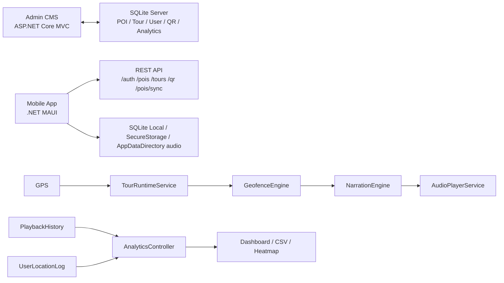
```mermaid
flowchart LR
    AdminCMS["Admin CMS<br/>ASP.NET Core MVC"] <--> SQLiteServer["SQLite Server<br/>POI / Tour / User / QR / Analytics"]
    MobileApp["Mobile App<br/>.NET MAUI"] --> RestAPI["REST API<br/>/auth /pois /tours /qr /pois/sync"]
    MobileApp --> LocalData["SQLite Local / SecureStorage / AppDataDirectory audio"]
    GPS["GPS"] --> TourRuntimeService["TourRuntimeService"]
    TourRuntimeService --> GeofenceEngine["GeofenceEngine"]
    GeofenceEngine --> NarrationEngine["NarrationEngine"]
    NarrationEngine --> AudioPlayerService["AudioPlayerService"]
    PlaybackHistory["PlaybackHistory"] --> AnalyticsController["AnalyticsController"]
    UserLocationLog["UserLocationLog"] --> AnalyticsController
    AnalyticsController --> Dashboard["Dashboard / CSV / Heatmap"]
```

## 2.2.1. Admin CMS - Xác Thực Quản Trị Viên

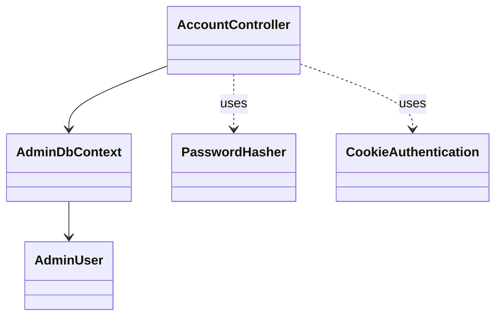
```mermaid
classDiagram
    class AccountController
    class AdminDbContext
    class AdminUser
    class PasswordHasherAdminUser["PasswordHasher<AdminUser>"]
    class CookieAuthentication

    AccountController --> AdminDbContext
    AdminDbContext --> AdminUser
    AccountController ..> PasswordHasherAdminUser : uses
    AccountController ..> CookieAuthentication : uses
```

## 2.2.2. Admin CMS - Dashboard Tổng Quan

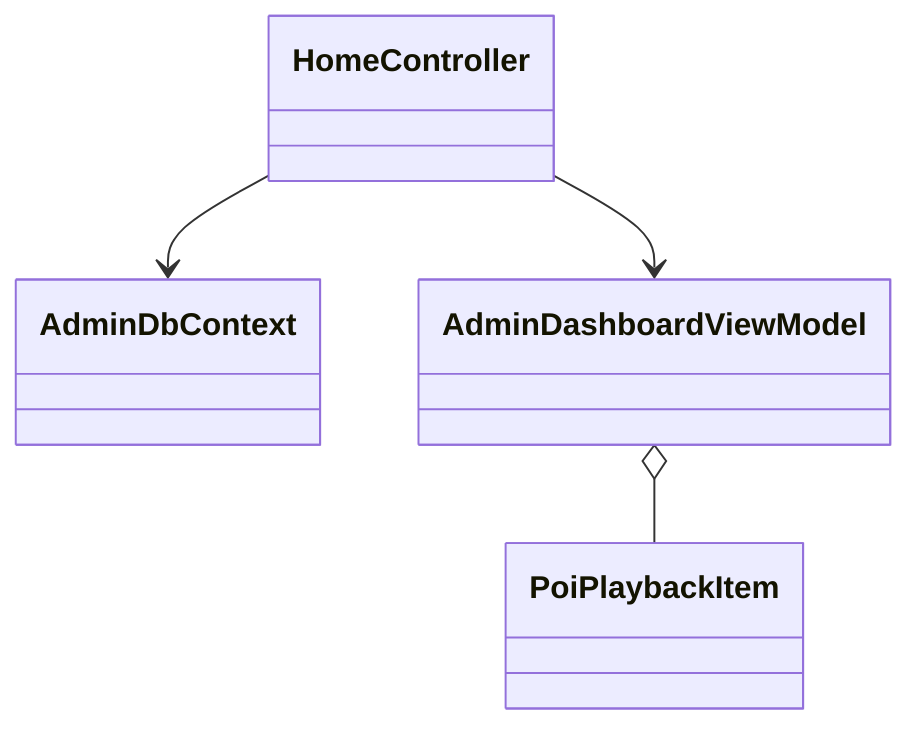
```mermaid
classDiagram
    class HomeController
    class AdminDbContext
    class AdminDashboardViewModel
    class PoiPlaybackItem

    HomeController --> AdminDbContext
    HomeController --> AdminDashboardViewModel
    AdminDashboardViewModel o-- PoiPlaybackItem
```

## 2.2.3. Admin CMS - Quản Lý POI

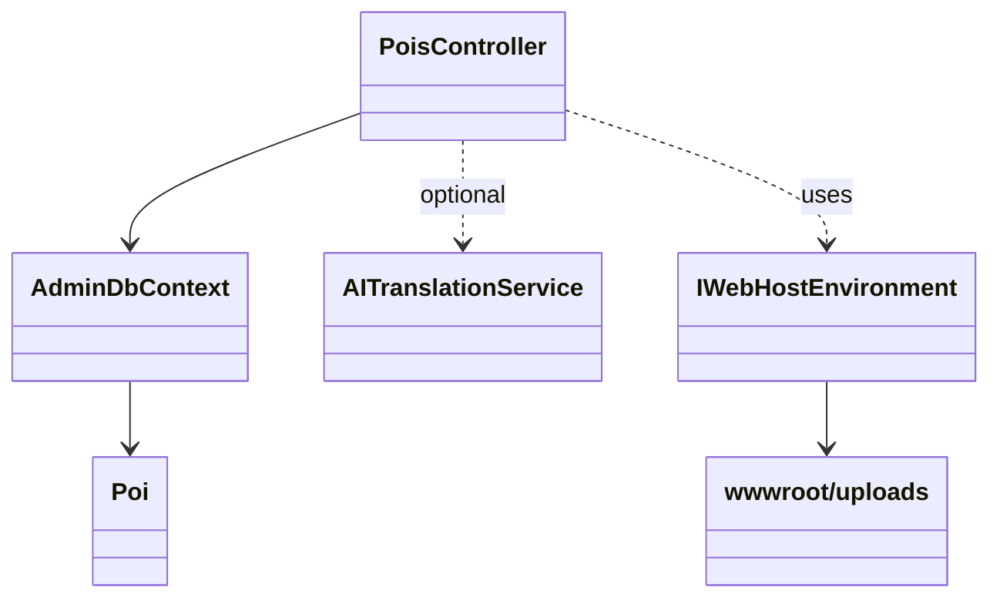
```mermaid
classDiagram
    class PoisController
    class AdminDbContext
    class Poi
    class AITranslationService
    class IWebHostEnvironment
    class UploadStorage["wwwroot/uploads"]

    PoisController --> AdminDbContext
    AdminDbContext --> Poi
    PoisController ..> AITranslationService : optional
    PoisController ..> IWebHostEnvironment : uses
    IWebHostEnvironment --> UploadStorage
```

## 2.2.4. Admin CMS - Dịch Thuật AI Và TTS

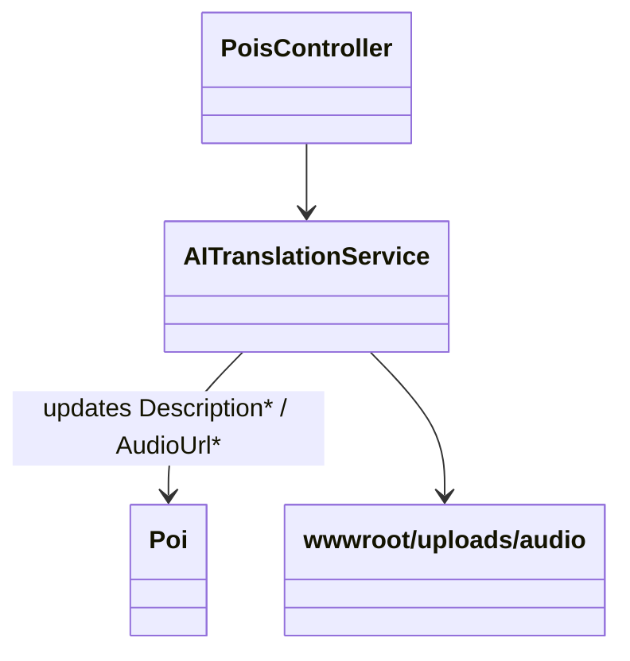
```mermaid
classDiagram
    class PoisController
    class AITranslationService
    class Poi
    class AudioStorage["wwwroot/uploads/audio"]

    PoisController --> AITranslationService
    AITranslationService --> Poi : updates Description* / AudioUrl*
    AITranslationService --> AudioStorage
```

## 2.2.5. Admin CMS - Quản Lý Tour

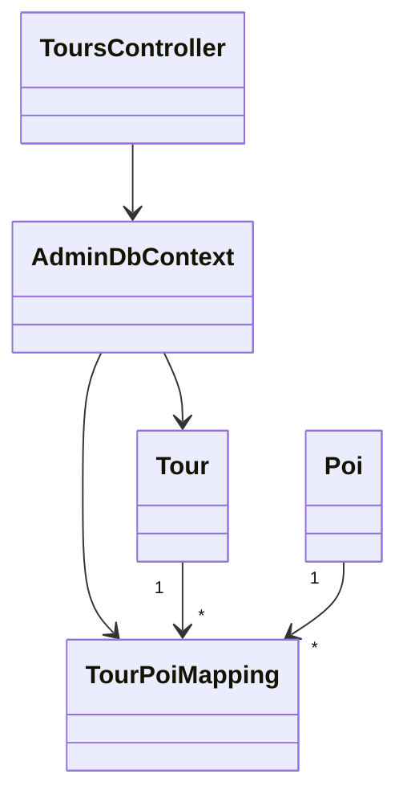
```mermaid
classDiagram
    class ToursController
    class AdminDbContext
    class Tour
    class TourPoiMapping
    class Poi

    ToursController --> AdminDbContext
    AdminDbContext --> Tour
    AdminDbContext --> TourPoiMapping
    Tour "1" --> "*" TourPoiMapping
    Poi "1" --> "*" TourPoiMapping
```

## 2.2.6. Admin CMS - Quản Lý Người Dùng Di Động

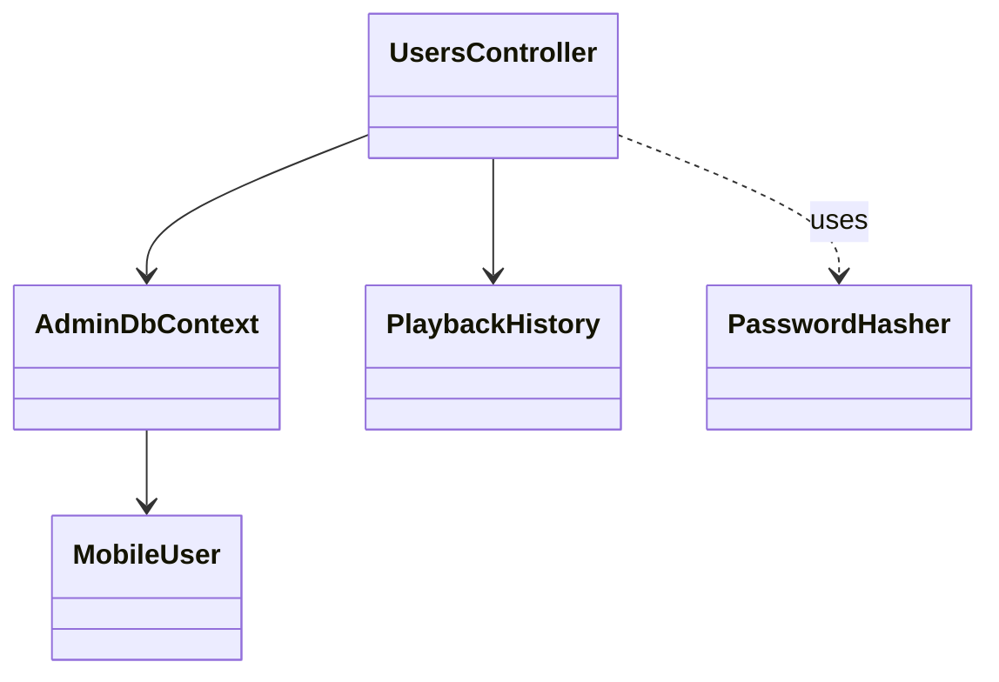
```mermaid
classDiagram
    class UsersController
    class AdminDbContext
    class MobileUser
    class PlaybackHistory
    class PasswordHasherMobileUser["PasswordHasher<MobileUser>"]

    UsersController --> AdminDbContext
    AdminDbContext --> MobileUser
    UsersController --> PlaybackHistory
    UsersController ..> PasswordHasherMobileUser : uses
```

## 2.2.7. Admin CMS - Quản Lý Mã QR

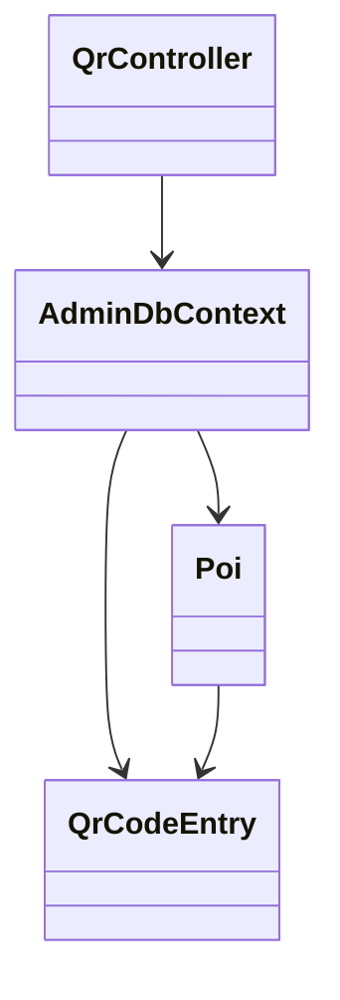
```mermaid
classDiagram
    class QrController
    class AdminDbContext
    class Poi
    class QrCodeEntry

    QrController --> AdminDbContext
    AdminDbContext --> Poi
    AdminDbContext --> QrCodeEntry
    Poi --> QrCodeEntry
```

## 2.2.8. Admin CMS - Phân Tích Và Báo Cáo

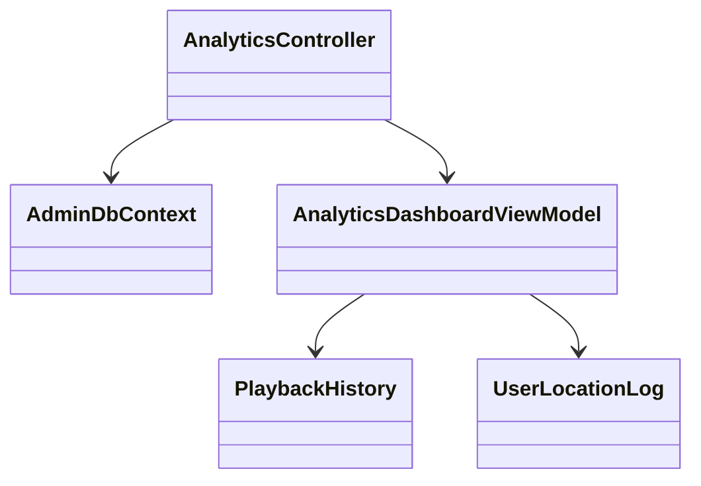
```mermaid
classDiagram
    class AnalyticsController
    class AdminDbContext
    class AnalyticsDashboardViewModel
    class PlaybackHistory
    class UserLocationLog

    AnalyticsController --> AdminDbContext
    AnalyticsController --> AnalyticsDashboardViewModel
    AnalyticsDashboardViewModel --> PlaybackHistory
    AnalyticsDashboardViewModel --> UserLocationLog
```

## 2.2.9. Mobile App - Khởi Động Và Đa Ngôn Ngữ

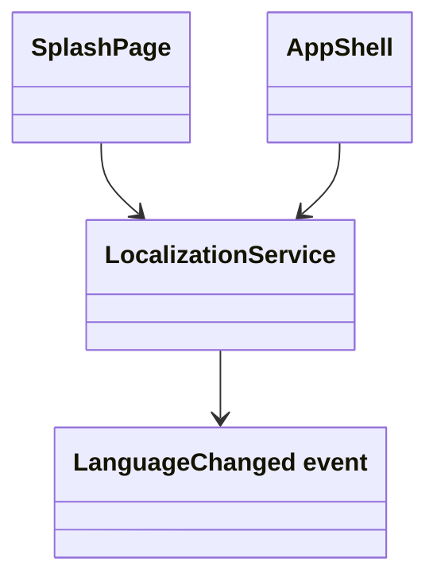
```mermaid
classDiagram
    class SplashPage
    class LocalizationService
    class LanguageChangedEvent["LanguageChanged event"]
    class AppShell

    SplashPage --> LocalizationService
    LocalizationService --> LanguageChangedEvent
    AppShell --> LocalizationService
```

## 2.2.10. Mobile App - Xác Thực Người Dùng

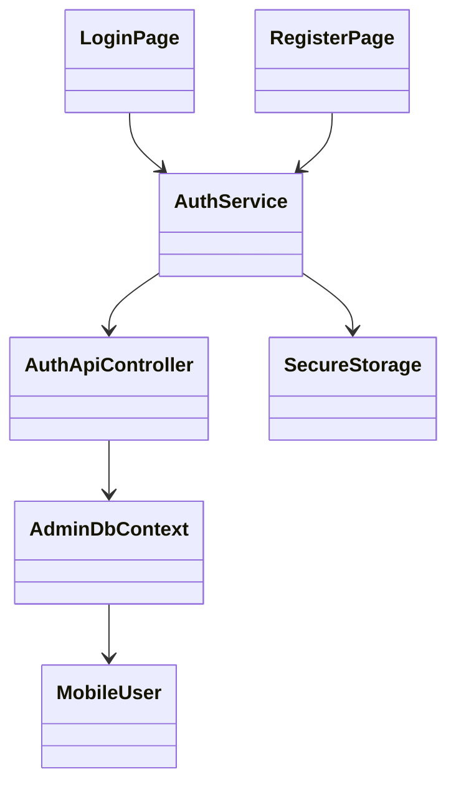
```mermaid
classDiagram
    class LoginPage
    class RegisterPage
    class AuthService
    class AuthApiController
    class AdminDbContext
    class MobileUser
    class SecureStorage

    LoginPage --> AuthService
    RegisterPage --> AuthService
    AuthService --> AuthApiController
    AuthApiController --> AdminDbContext
    AdminDbContext --> MobileUser
    AuthService --> SecureStorage
```

## 2.2.11. Mobile App - Bản Đồ Và GPS

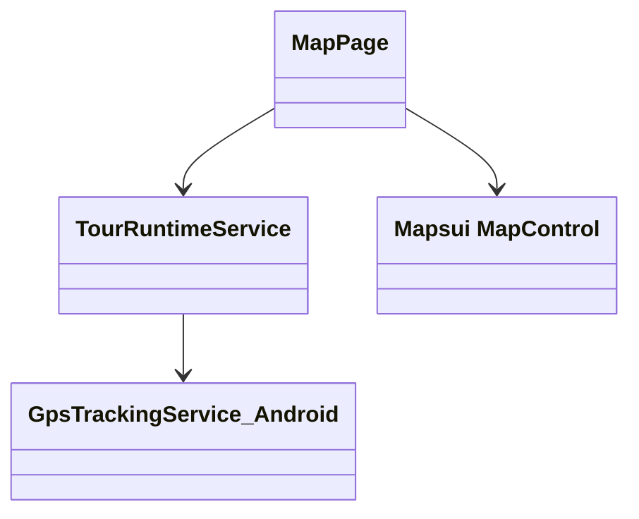
```mermaid
classDiagram
    class MapPage
    class TourRuntimeService
    class GpsTrackingServiceAndroid["GpsTrackingService_Android"]
    class MapsuiMapControl["Mapsui MapControl"]

    MapPage --> TourRuntimeService
    TourRuntimeService --> GpsTrackingServiceAndroid
    MapPage --> MapsuiMapControl
```

## 2.2.12. Mobile App - Khám Phá POI Và Chi Tiết

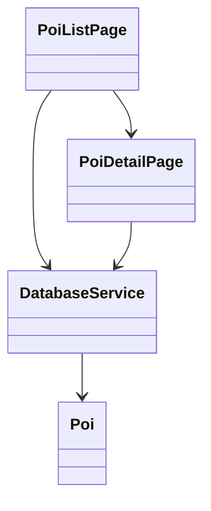
```mermaid
classDiagram
    class PoiListPage
    class PoiDetailPage
    class DatabaseService
    class Poi

    PoiListPage --> DatabaseService
    DatabaseService --> Poi
    PoiListPage --> PoiDetailPage
    PoiDetailPage --> DatabaseService
```

## 2.2.13. Mobile App - Geofence Và Phát Âm Thanh

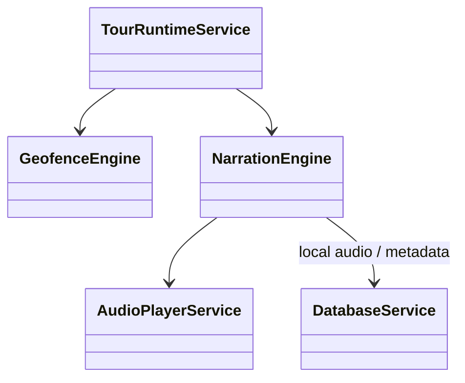
```mermaid
classDiagram
    class TourRuntimeService
    class GeofenceEngine
    class NarrationEngine
    class AudioPlayerService
    class DatabaseService

    TourRuntimeService --> GeofenceEngine
    TourRuntimeService --> NarrationEngine
    NarrationEngine --> AudioPlayerService
    NarrationEngine --> DatabaseService : local audio / metadata
```

## 2.2.14. Mobile App - Quét Mã QR

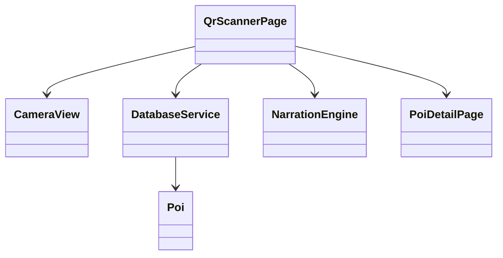
```mermaid
classDiagram
    class QrScannerPage
    class CameraView
    class DatabaseService
    class Poi
    class NarrationEngine
    class PoiDetailPage

    QrScannerPage --> CameraView
    QrScannerPage --> DatabaseService
    DatabaseService --> Poi
    QrScannerPage --> NarrationEngine
    QrScannerPage --> PoiDetailPage
```

## 2.2.15. Mobile App - Đồng Bộ Offline Và Dữ Liệu Cục Bộ

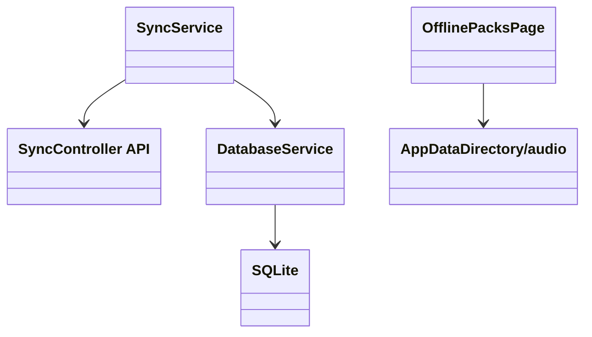
```mermaid
classDiagram
    class SyncService
    class SyncControllerAPI["SyncController API"]
    class DatabaseService
    class SQLite
    class OfflinePacksPage
    class AppDataAudio["AppDataDirectory/audio"]

    SyncService --> SyncControllerAPI
    SyncService --> DatabaseService
    DatabaseService --> SQLite
    OfflinePacksPage --> AppDataAudio
```

## 2.2.16. Mobile App - Hồ Sơ Và Cài Đặt

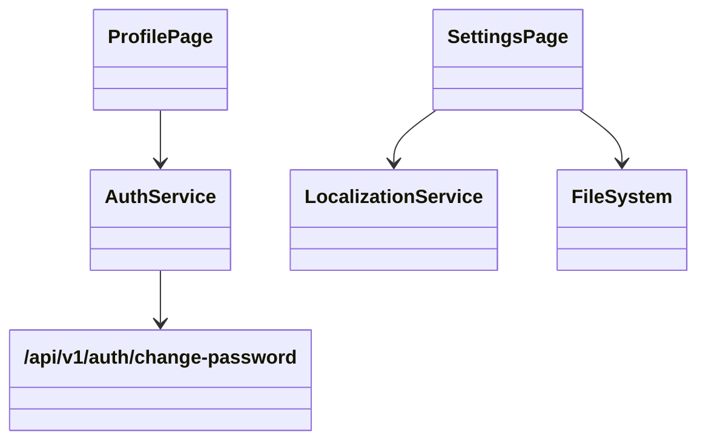
```mermaid
classDiagram
    class ProfilePage
    class SettingsPage
    class AuthService
    class LocalizationService
    class FileSystem
    class ChangePasswordAPI["/api/v1/auth/change-password"]

    ProfilePage --> AuthService
    SettingsPage --> LocalizationService
    SettingsPage --> FileSystem
    AuthService --> ChangePasswordAPI
```

## 3.1. Luồng Tạo Và Xử Lý POI Bằng AI

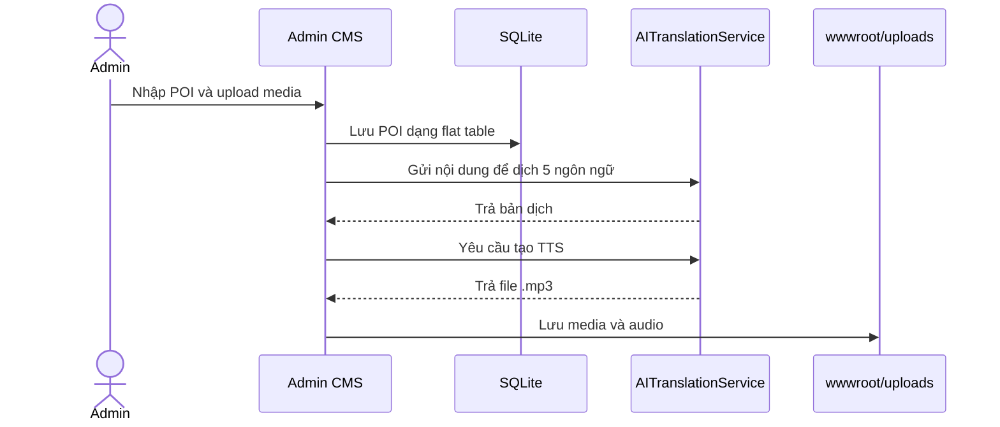
```mermaid
sequenceDiagram
    actor Admin as Admin
    participant CMS as Admin CMS
    participant DB as SQLite
    participant AI as AITranslationService
    participant Storage as wwwroot/uploads

    Admin->>CMS: Nhập POI và upload media
    CMS->>DB: Lưu POI dạng flat table
    CMS->>AI: Gửi nội dung để dịch 5 ngôn ngữ
    AI-->>CMS: Trả bản dịch
    CMS->>AI: Yêu cầu tạo TTS
    AI-->>CMS: Trả file .mp3
    CMS->>Storage: Lưu media và audio
```

## 3.2. Luồng Định Vị Và Tự Động Phát Thuyết Minh

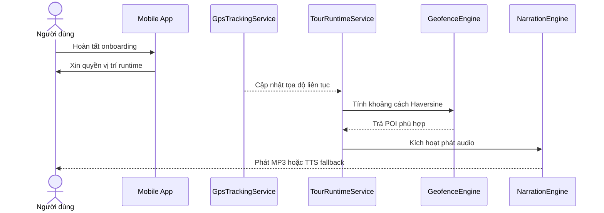
```mermaid
sequenceDiagram
    actor User as Người dùng
    participant App as Mobile App
    participant GPS as GpsTrackingService
    participant Runtime as TourRuntimeService
    participant Geo as GeofenceEngine
    participant Narration as NarrationEngine

    User->>App: Hoàn tất onboarding
    App->>User: Xin quyền vị trí runtime
    GPS-->>Runtime: Cập nhật tọa độ liên tục
    Runtime->>Geo: Tính khoảng cách Haversine
    Geo-->>Runtime: Trả POI phù hợp
    Runtime->>Narration: Kích hoạt phát audio
    Narration-->>User: Phát MP3 hoặc TTS fallback
```

## 3.3. Luồng Đồng Bộ Dữ Liệu Offline

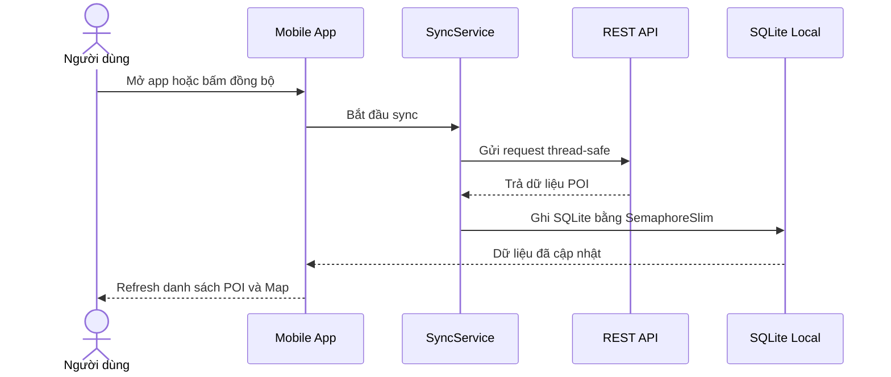
```mermaid
sequenceDiagram
    actor User as Người dùng
    participant App as Mobile App
    participant Sync as SyncService
    participant API as REST API
    participant LocalDB as SQLite Local

    User->>App: Mở app hoặc bấm đồng bộ
    App->>Sync: Bắt đầu sync
    Sync->>API: Gửi request thread-safe
    API-->>Sync: Trả dữ liệu POI
    Sync->>LocalDB: Ghi SQLite bằng SemaphoreSlim
    LocalDB-->>App: Dữ liệu đã cập nhật
    App-->>User: Refresh danh sách POI và Map
```

## 3.4. Luồng Quét QR Truy Xuất POI

```mermaid
sequenceDiagram
    actor Admin as Admin
    participant CMS as Admin CMS
    actor User as Người dùng
    participant Scanner as QrScannerPage
    participant Data as DatabaseService
    participant App as Mobile App

    Admin->>CMS: Tạo QR cho POI
    CMS-->>Admin: Xuất deep-link QR
    User->>Scanner: Quét mã QR
    Scanner->>App: Parse POI id
    App->>Data: Tải nội dung POI
    Data-->>App: Trả chi tiết POI
    App-->>User: Mở nhanh POI tương ứng
```

## 3.5.1. Luồng Xử Lý - Admin CMS - Xác Thực Quản Trị Viên

```mermaid
sequenceDiagram
    actor Admin as Quản trị viên
    participant AccountController
    participant AdminDbContext
    participant PasswordHasher
    participant CookieAuth
    participant Dashboard

    Admin->>AccountController: Login(username, password)
    AccountController->>AdminDbContext: Tìm AdminUser
    AdminDbContext-->>AccountController: AdminUser
    AccountController->>PasswordHasher: Xác thực mật khẩu
    PasswordHasher-->>AccountController: Hợp lệ
    AccountController->>CookieAuth: Tạo phiên
    CookieAuth-->>Dashboard: Authenticated
    Dashboard-->>Admin: Chuyển vào dashboard
```

## 3.5.2. Luồng Xử Lý - Admin CMS - Dashboard Tổng Quan

```mermaid
sequenceDiagram
    actor Admin as Quản trị viên
    participant HomeController
    participant AdminDbContext
    participant ViewModel as AdminDashboardViewModel
    participant View

    Admin->>HomeController: Mở dashboard
    HomeController->>AdminDbContext: Đếm POI, tour, user, QR, lượt phát
    AdminDbContext-->>HomeController: Metric tổng hợp
    HomeController->>ViewModel: Đóng gói dữ liệu
    HomeController->>View: Render dashboard
    View-->>Admin: Hiển thị KPI và top POI
```

## 3.5.3. Luồng Xử Lý - Admin CMS - Quản Lý POI

```mermaid
sequenceDiagram
    actor Admin as Quản trị viên
    participant PoisController
    participant Uploads as wwwroot/uploads
    participant AdminDbContext
    participant Poi

    Admin->>PoisController: Create/Edit POI
    PoisController->>Uploads: Tải ảnh và âm thanh
    PoisController->>AdminDbContext: Thêm hoặc cập nhật POI
    AdminDbContext->>Poi: Persist dữ liệu
    AdminDbContext-->>Admin: Quay lại danh sách POI
```

## 3.5.4. Luồng Xử Lý - Admin CMS - Dịch Thuật AI Và TTS

```mermaid
sequenceDiagram
    actor Admin as Quản trị viên
    participant PoisController
    participant AI as AITranslationService
    participant Poi
    participant AdminDbContext

    Admin->>PoisController: Create/Edit(autoAI=true)
    PoisController->>AI: Gửi nội dung mô tả
    AI-->>PoisController: Bản dịch và TTS
    PoisController->>Poi: Cập nhật Description* / AudioUrl*
    PoisController->>AdminDbContext: Lưu thay đổi
    AdminDbContext-->>Admin: Hoàn tất xử lý
```

## 3.5.5. Luồng Xử Lý - Admin CMS - Quản Lý Tour

```mermaid
sequenceDiagram
    actor Admin as Quản trị viên
    participant ToursController
    participant AdminDbContext
    participant Tour
    participant TourPoiMapping

    Admin->>ToursController: Create/Edit tour
    ToursController->>AdminDbContext: Lưu Tour
    AdminDbContext->>Tour: Persist tour
    ToursController->>AdminDbContext: Thêm/xóa TourPoiMapping
    AdminDbContext->>TourPoiMapping: Persist thứ tự POI
    AdminDbContext-->>Admin: Cập nhật danh sách tour
```

## 3.5.6. Luồng Xử Lý - Admin CMS - Quản Lý Người Dùng Di Động

```mermaid
sequenceDiagram
    actor Admin as Quản trị viên
    participant UsersController
    participant AdminDbContext
    participant MobileUser

    Admin->>UsersController: Index/Details
    UsersController->>AdminDbContext: Truy vấn MobileUser
    AdminDbContext-->>UsersController: Danh sách user
    Admin->>UsersController: ChangeRole / ResetPassword / Delete
    UsersController->>AdminDbContext: Lưu thay đổi
    AdminDbContext->>MobileUser: Update tài khoản
    UsersController-->>Admin: Thông báo kết quả
```

## 3.5.7. Luồng Xử Lý - Admin CMS - Quản Lý Mã QR

```mermaid
sequenceDiagram
    actor Admin as Quản trị viên
    participant QrController
    participant AdminDbContext
    participant Poi
    participant QrCodeEntry

    Admin->>QrController: Generate QR
    QrController->>AdminDbContext: Tải POI
    AdminDbContext-->>QrController: Poi
    QrController->>QrController: Tạo deep-link và qrImageUrl
    QrController->>AdminDbContext: Lưu QrCodeEntry
    AdminDbContext->>QrCodeEntry: Persist QR
    QrController-->>Admin: Hiển thị QR trong danh sách
```

## 3.5.8. Luồng Xử Lý - Admin CMS - Phân Tích Và Báo Cáo

```mermaid
sequenceDiagram
    actor Admin as Quản trị viên
    participant AnalyticsController
    participant AdminDbContext
    participant ViewModel as AnalyticsDashboardViewModel

    Admin->>AnalyticsController: Index / ExportCsv
    AnalyticsController->>AdminDbContext: Query PlaybackHistory + UserLocationLog
    AdminDbContext-->>AnalyticsController: Dữ liệu analytics
    AnalyticsController->>ViewModel: Tổng hợp dữ liệu
    ViewModel-->>AnalyticsController: Chart / CSV model
    AnalyticsController-->>Admin: Hiển thị biểu đồ hoặc trả CSV
```

## 3.5.9. Luồng Xử Lý - Mobile App - Khởi Động Và Đa Ngôn Ngữ

```mermaid
sequenceDiagram
    actor User as Người dùng
    participant SplashPage
    participant LocalizationService
    participant AppShell

    User->>SplashPage: Chọn ngôn ngữ
    SplashPage->>LocalizationService: Set CurrentLanguage
    LocalizationService->>AppShell: Fire LanguageChanged
    AppShell-->>User: Cập nhật giao diện
```

## 3.5.10. Luồng Xử Lý - Mobile App - Xác Thực Người Dùng

```mermaid
sequenceDiagram
    actor User as Người dùng
    participant UI as LoginPage/RegisterPage
    participant AuthService
    participant AuthAPI as /api/v1/auth
    participant SecureStorage
    participant AppShell

    User->>UI: Nhập thông tin đăng nhập hoặc đăng ký
    UI->>AuthService: Submit credentials
    AuthService->>AuthAPI: Authenticate / Register
    AuthAPI-->>AuthService: Token và profile
    AuthService->>SecureStorage: Lưu token / profile
    AuthService-->>AppShell: Điều hướng vào app chính
    AppShell-->>User: Phiên mobile sẵn sàng
```

## 3.5.11. Luồng Xử Lý - Mobile App - Bản Đồ Và GPS

```mermaid
sequenceDiagram
    actor User as Người dùng
    participant MapPage
    participant Runtime as TourRuntimeService
    participant GPS as GPS service
    participant Mapsui

    User->>MapPage: Mở bản đồ
    MapPage->>Runtime: InitializeAsync()
    Runtime->>GPS: Lấy tọa độ
    GPS-->>Runtime: Current location
    MapPage->>Mapsui: Vẽ marker POI và current location
    User->>MapPage: Chạm marker
    MapPage-->>User: Mở preview hoặc chi tiết
```

## 3.5.12. Luồng Xử Lý - Mobile App - Khám Phá POI Và Chi Tiết

```mermaid
sequenceDiagram
    actor User as Người dùng
    participant PoiListPage
    participant DatabaseService
    participant CollectionView
    participant PoiDetailPage

    User->>PoiListPage: Mở danh sách POI
    PoiListPage->>DatabaseService: Tải POI
    DatabaseService-->>PoiListPage: Danh sách POI
    User->>PoiListPage: Tìm kiếm hoặc lọc
    PoiListPage->>CollectionView: Cập nhật danh sách
    User->>PoiDetailPage: Chọn POI
    PoiDetailPage-->>User: Hiển thị chi tiết
```

## 3.5.13. Luồng Xử Lý - Mobile App - Geofence Và Phát Âm Thanh

```mermaid
sequenceDiagram
    participant GPS as GPS update
    participant Runtime as TourRuntimeService
    participant Geo as GeofenceEngine
    participant Narration as NarrationEngine
    participant Audio as AudioPlayerService
    participant History as PlaybackHistory

    GPS-->>Runtime: Tọa độ mới
    Runtime->>Geo: Tìm POI gần nhất
    Geo-->>Runtime: Radius / debounce / cooldown hợp lệ
    Runtime->>Narration: OnPOITriggeredAsync()
    Narration->>Audio: Phát MP3 / TTS
    Audio-->>History: Ghi playback history
```

## 3.5.14. Luồng Xử Lý - Mobile App - Quét Mã QR

```mermaid
sequenceDiagram
    actor User as Người dùng
    participant QrScannerPage
    participant CameraView
    participant DatabaseService
    participant NarrationEngine
    participant PoiDetailPage

    User->>QrScannerPage: Mở màn hình quét QR
    CameraView-->>QrScannerPage: OnQrDetected
    QrScannerPage->>QrScannerPage: ParsePoiId
    QrScannerPage->>DatabaseService: Tìm POI
    DatabaseService-->>QrScannerPage: Chi tiết POI
    User->>QrScannerPage: Bấm mở và phát thuyết minh
    QrScannerPage->>NarrationEngine: Phát audio
    QrScannerPage->>PoiDetailPage: Điều hướng chi tiết
```

## 3.5.15. Luồng Xử Lý - Mobile App - Đồng Bộ Offline Và Dữ Liệu Cục Bộ

```mermaid
sequenceDiagram
    actor User as Người dùng / Hệ thống
    participant SyncService
    participant API as /api/v1/pois/sync/pois
    participant DatabaseService
    participant OfflinePacksPage
    participant UI

    User->>SyncService: SyncPoisFromServerAsync()
    SyncService->>API: Yêu cầu đồng bộ
    API-->>SyncService: Trả dữ liệu POI
    SyncService->>DatabaseService: Ghi SQLite
    OfflinePacksPage->>OfflinePacksPage: Tạo/xóa file audio AppData
    UI-->>User: Cập nhật trạng thái lưu trữ và lần sync cuối
```

## 3.5.16. Luồng Xử Lý - Mobile App - Hồ Sơ Và Cài Đặt

```mermaid
sequenceDiagram
    actor User as Người dùng
    participant ProfilePage
    participant SettingsPage
    participant AuthService
    participant LocalizationService
    participant FileSystem

    User->>ProfilePage: Mở hồ sơ
    ProfilePage->>AuthService: Lấy CurrentUser / đổi mật khẩu / đăng xuất
    User->>SettingsPage: Mở cài đặt
    SettingsPage->>LocalizationService: Đổi ngôn ngữ
    SettingsPage->>FileSystem: Xóa cache
    AuthService-->>User: Cập nhật phiên
    LocalizationService-->>User: Cập nhật giao diện
```

