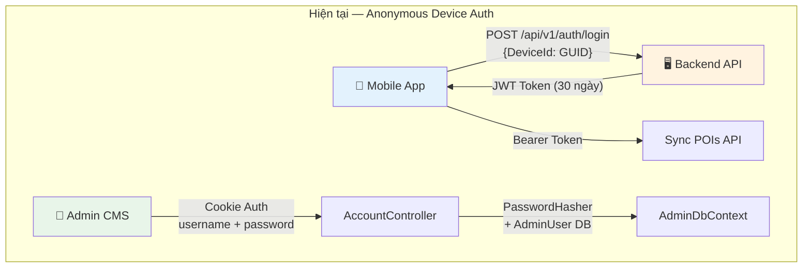
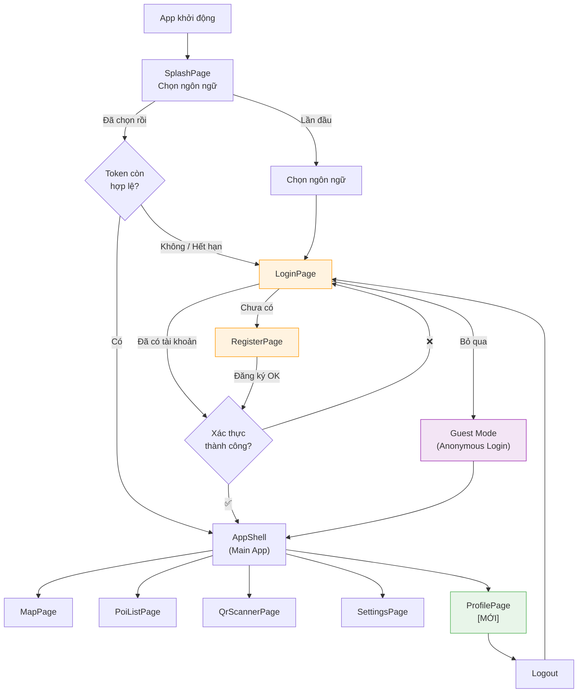
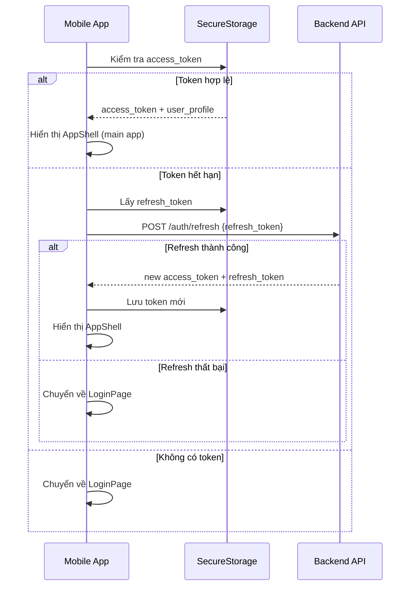
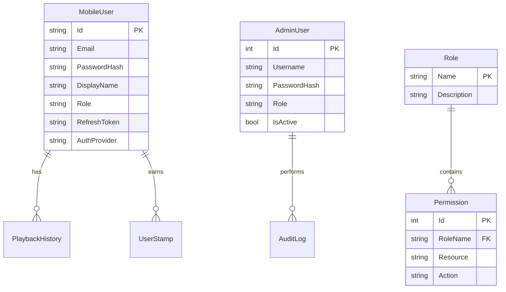
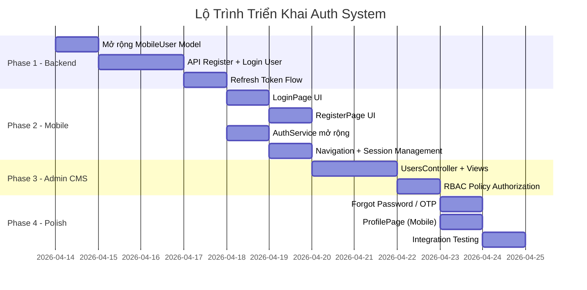

# 🔐 Phân Tích Tính Khả Thi: Hệ Thống Authentication & Identity

> **Dự án:** AudioTourMap (.NET MAUI + ASP.NET Core AdminWeb)  
> **Ngày phân tích:** 2026-04-12  
> **Phạm vi:** Mobile App Login/Logout + Admin CMS User Management + RBAC

---

## Mục Lục

1. [Đánh Giá Mức Độ Sẵn Sàng Của Kiến Trúc Hiện Tại](#1-đánh-giá-mức-độ-sẵn-sàng-của-kiến-trúc-hiện-tại)
2. [Triển Khai Trên Mobile App (.NET MAUI)](#2-triển-khai-trên-mobile-app-net-maui)
3. [Triển Khai Phía Backend & Admin CMS](#3-triển-khai-phía-backend--admin-cms)
4. [Đề Xuất Công Nghệ & So Sánh Giải Pháp](#4-đề-xuất-công-nghệ--so-sánh-giải-pháp)
5. [Lộ Trình Triển Khai & Effort Estimation](#5-lộ-trình-triển-khai--effort-estimation)

---

## 1. Đánh Giá Mức Độ Sẵn Sàng Của Kiến Trúc Hiện Tại

### 1.1 Tổng Quan Hiện Trạng Auth



### 1.2 Bảng Phân Tích Thành Phần (Gap Analysis)

| Thành Phần | Hiện Trạng | Mức Sẵn Sàng | Cần Bổ Sung |
|---|---|---|---|
| **JWT Token Generation** | ✅ Đã có ([AuthApiController](file:///d:/Code/ProjectCSharp/Project-CSharp-SGU-main/TourMap/TourMap.AdminWeb/Controllers/Api/AuthApiController.cs)) | 🟢 80% | Thêm email/password claims, refresh token |
| **JWT Validation Middleware** | ✅ Đã cấu hình ([Program.cs](file:///d:/Code/ProjectCSharp/Project-CSharp-SGU-main/TourMap/TourMap.AdminWeb/Program.cs#L41-L54)) | 🟢 90% | Chỉ cần thêm policy-based authorization |
| **SecureStorage (Mobile)** | ✅ Đã dùng ([AuthService.cs](file:///d:/Code/ProjectCSharp/Project-CSharp-SGU-main/TourMap/Services/AuthService.cs#L31-L66)) | 🟢 85% | Mở rộng thêm user profile caching |
| **AdminUser Model** | ✅ Đã có ([AdminUser.cs](file:///d:/Code/ProjectCSharp/Project-CSharp-SGU-main/TourMap/TourMap.AdminWeb/Models/AdminUser.cs)) | 🟢 75% | Thêm Email, Phone, permissions list |
| **MobileUser Model** | ⚠️ Chỉ anonymous ([MobileUser.cs](file:///d:/Code/ProjectCSharp/Project-CSharp-SGU-main/TourMap/TourMap.AdminWeb/Models/MobileUser.cs)) | 🟡 40% | Cần thêm Email, PasswordHash, DisplayName, Role |
| **PasswordHasher** | ✅ Đã dùng ([AccountController](file:///d:/Code/ProjectCSharp/Project-CSharp-SGU-main/TourMap/TourMap.AdminWeb/Controllers/AccountController.cs#L62)) | 🟢 95% | Đã sử dụng ASP.NET Identity PasswordHasher |
| **Cookie Auth (Admin)** | ✅ Đã cấu hình ([Program.cs](file:///d:/Code/ProjectCSharp/Project-CSharp-SGU-main/TourMap/TourMap.AdminWeb/Program.cs#L31-L40)) | 🟢 90% | Đầy đủ cho CMS |
| **Login UI (Mobile)** | ❌ Chưa có | 🔴 0% | Cần tạo hoàn toàn mới |
| **Register UI (Mobile)** | ❌ Chưa có | 🔴 0% | Cần tạo hoàn toàn mới |
| **Refresh Token Flow** | ❌ Chưa có | 🔴 0% | Cần thiết kế và triển khai |
| **Database Migration** | ✅ Có `EnsureCompatibilityColumns` | 🟡 60% | Cần thêm cột mới cho MobileUser |

### 1.3 Kết Luận Mức Độ Sẵn Sàng

> [!IMPORTANT]
> **Kiến trúc hiện tại KHÔNG cần đập đi xây lại.** Hạ tầng JWT, PasswordHasher, SecureStorage, và Database đều có sẵn. Việc cần làm chủ yếu là **mở rộng** (extend) các thành phần đã có, không phải thay thế.

**Điểm mạnh lớn nhất:** Backend đã có dual Authentication scheme (Cookie cho Admin CMS + JWT Bearer cho Mobile API) — đây chính là nền tảng để tích hợp auth cho mobile user mà không cần thay đổi kiến trúc.

**Rủi ro lớn nhất:** `MobileUser` hiện tại quá đơn giản (chỉ có DeviceId), cần mở rộng đáng kể để hỗ trợ email/password login.

---

## 2. Triển Khai Trên Mobile App (.NET MAUI)

### 2.1 Luồng Navigation Mới



### 2.2 Đánh Giá Mức Độ Phức Tạp UI/UX

| Màn Hình | Phức Tạp | Mô Tả |
|---|---|---|
| **LoginPage** | 🟡 Trung bình | Form email/password + nút "Đăng nhập ẩn danh" + nút Google/Apple Sign-In (optional) |
| **RegisterPage** | 🟡 Trung bình | Form email/password/confirm + validation rules |
| **ProfilePage** | 🟢 Thấp | Hiển thị avatar, display name, email, nút Logout, lịch sử tour |
| **ForgotPasswordPage** | 🟡 Trung bình | Gửi OTP qua email + form nhập OTP + đổi mật khẩu |

### 2.3 Services Cần Bổ Sung

#### 2.3.1 Mở Rộng `AuthService` Hiện Tại

```csharp
// === Phần MỚI thêm vào AuthService.cs hiện có ===

public class AuthService
{
    // --- Đã có ---
    public string? CurrentToken { get; private set; }
    public async Task<bool> LoginAnonymousAsync() { /* ... */ }

    // --- CẦN THÊM ---
    
    /// <summary>Trạng thái đăng nhập hiện tại</summary>
    public bool IsAuthenticated => !string.IsNullOrEmpty(CurrentToken) && !IsTokenExpired();
    public bool IsGuest => _loginMode == LoginMode.Anonymous;
    public UserProfile? CurrentUser { get; private set; }

    /// <summary>Đăng nhập bằng email/password</summary>
    public async Task<AuthResult> LoginAsync(string email, string password)
    {
        var request = new { Email = email, Password = password };
        var response = await _httpClient.PostAsJsonAsync(
            $"{BaseUrl}/api/v1/auth/login-user", request);

        if (!response.IsSuccessStatusCode)
            return new AuthResult(false, "Email hoặc mật khẩu không đúng");

        var result = await response.Content.ReadFromJsonAsync<LoginUserResponse>();
        CurrentToken = result!.AccessToken;
        
        // Lưu vào SecureStorage
        await SecureStorage.Default.SetAsync("access_token", result.AccessToken);
        await SecureStorage.Default.SetAsync("refresh_token", result.RefreshToken);
        await SecureStorage.Default.SetAsync("user_profile", 
            JsonSerializer.Serialize(result.User));

        CurrentUser = result.User;
        return new AuthResult(true);
    }

    /// <summary>Đăng ký tài khoản mới</summary>
    public async Task<AuthResult> RegisterAsync(string email, string password, string displayName)
    {
        var request = new { Email = email, Password = password, DisplayName = displayName };
        var response = await _httpClient.PostAsJsonAsync(
            $"{BaseUrl}/api/v1/auth/register", request);

        if (!response.IsSuccessStatusCode)
        {
            var error = await response.Content.ReadAsStringAsync();
            return new AuthResult(false, error);
        }

        // Tự động login sau khi đăng ký thành công
        return await LoginAsync(email, password);
    }

    /// <summary>Refresh token khi access token hết hạn</summary>
    public async Task<bool> RefreshTokenAsync()
    {
        var refreshToken = await SecureStorage.Default.GetAsync("refresh_token");
        if (string.IsNullOrEmpty(refreshToken)) return false;

        var response = await _httpClient.PostAsJsonAsync(
            $"{BaseUrl}/api/v1/auth/refresh", 
            new { RefreshToken = refreshToken });

        if (!response.IsSuccessStatusCode) return false;

        var result = await response.Content.ReadFromJsonAsync<TokenRefreshResponse>();
        CurrentToken = result!.AccessToken;
        await SecureStorage.Default.SetAsync("access_token", result.AccessToken);
        await SecureStorage.Default.SetAsync("refresh_token", result.RefreshToken);
        return true;
    }

    /// <summary>Đăng xuất — xóa token + chuyển về LoginPage</summary>
    public async Task LogoutAsync()
    {
        CurrentToken = null;
        CurrentUser = null;
        SecureStorage.Default.Remove("access_token");
        SecureStorage.Default.Remove("refresh_token");
        SecureStorage.Default.Remove("user_profile");
    }

    private bool IsTokenExpired()
    {
        if (string.IsNullOrEmpty(CurrentToken)) return true;
        var handler = new System.IdentityModel.Tokens.Jwt.JwtSecurityTokenHandler();
        var token = handler.ReadJwtToken(CurrentToken);
        return token.ValidTo <= DateTime.UtcNow;
    }
}

// DTOs
public record AuthResult(bool Success, string? ErrorMessage = null);
public record UserProfile(string Id, string Email, string DisplayName, string Role);
public record LoginUserResponse(string AccessToken, string RefreshToken, UserProfile User);
public record TokenRefreshResponse(string AccessToken, string RefreshToken);
```

#### 2.3.2 Session Lifecycle Management



#### 2.3.3 Chiến Lược Lưu Trữ Token

| Dữ liệu | Storage | Lý do |
|---|---|---|
| `access_token` | **SecureStorage** (đã dùng) | Mã hóa bởi OS (Keychain/Keystore) |
| `refresh_token` | **SecureStorage** | Nhạy cảm hơn access_token |
| `user_profile` (cache) | **SecureStorage** hoặc **Preferences** | Hiển thị offline, không quá nhạy cảm |
| `selected_language` | **Preferences** (đã dùng) | Không nhạy cảm |
| `device_uuid` | **Preferences** (đã dùng) | Vẫn giữ cho Guest mode |

### 2.4 Tác Động Đến Luồng Navigation Hiện Tại

> [!NOTE]
> **SplashPage** hiện tại kiểm tra `selected_language` rồi chuyển thẳng sang `AppShell`. Cần thêm 1 bước kiểm tra auth state giữa 2 bước này.

**Thay đổi cần thiết trong [SplashPage.cs](file:///d:/Code/ProjectCSharp/Project-CSharp-SGU-main/TourMap/Pages/SplashPage.cs#L87-L110):**

```csharp
protected override async void OnAppearing()
{
    base.OnAppearing();
    
    var savedLang = Preferences.Default.Get("selected_language", string.Empty);
    if (!string.IsNullOrEmpty(savedLang))
    {
        LocalizationService.Current.CurrentLanguage = savedLang;
        await Task.Delay(600);

        // === THÊM: Kiểm tra auth state ===
        var authService = Handler?.MauiContext?.Services.GetService<AuthService>();
        if (authService != null)
        {
            await authService.InitializeAsync();
            if (authService.IsAuthenticated)
            {
                // Đã login → vào app chính
                NavigateToShell();
                return;
            }
        }
        
        // Chưa login → về LoginPage
        NavigateToLogin();
    }
}
```

---

## 3. Triển Khai Phía Backend & Admin CMS

### 3.1 Mở Rộng Database Schema

#### 3.1.1 Mô Hình MobileUser Mới

```csharp
public class MobileUser
{
    [Key]
    public string Id { get; set; } = Guid.NewGuid().ToString();

    // === Đã có ===
    [Required]
    public string DeviceId { get; set; } = string.Empty;
    public DateTime CreatedAt { get; set; } = DateTime.UtcNow;
    public DateTime LastLoginAt { get; set; } = DateTime.UtcNow;

    // === CẦN THÊM ===
    [MaxLength(256)]
    public string? Email { get; set; }                  // null = Guest mode

    public string? PasswordHash { get; set; }           // null = Guest / OAuth user

    [MaxLength(100)]
    public string DisplayName { get; set; } = "Khách";

    [MaxLength(500)]
    public string? AvatarUrl { get; set; }

    [Required]
    [MaxLength(20)]
    public string Role { get; set; } = "Guest";         // Guest, User, Premium

    public string? RefreshToken { get; set; }
    public DateTime? RefreshTokenExpiresAt { get; set; }

    public bool IsEmailVerified { get; set; } = false;

    [MaxLength(20)]
    public string? AuthProvider { get; set; }            // "local", "google", "apple"
}
```

#### 3.1.2 Sơ Đồ Quan Hệ RBAC



### 3.2 Hệ Thống RBAC (Role-Based Access Control)

#### 3.2.1 Ma Trận Phân Quyền

| API Endpoint | Guest | User | Premium | Admin |
|---|---|---|---|---|
| `GET /api/v1/pois/sync/pois` | ✅ | ✅ | ✅ | ✅ |
| `POST /api/v1/pois/sync/history` | ✅ | ✅ | ✅ | ✅ |
| `GET /api/v1/user/profile` | ❌ | ✅ | ✅ | ✅ |
| `PUT /api/v1/user/profile` | ❌ | ✅ | ✅ | ✅ |
| Download Audio (Multilingual) | 🔒 vi only | 🔒 vi, en | ✅ All | ✅ All |
| Offline Packs Download | ❌ | 🔒 1 pack | ✅ Unlimited | ✅ |
| Admin CMS Access | ❌ | ❌ | ❌ | ✅ |
| CRUD POIs | ❌ | ❌ | ❌ | ✅ |
| View Analytics | ❌ | ❌ | ❌ | ✅ |
| Manage Users | ❌ | ❌ | ❌ | ✅ |

#### 3.2.2 API Endpoints Mới Cần Thêm

```
POST   /api/v1/auth/register          ← Đăng ký email/password
POST   /api/v1/auth/login-user        ← Đăng nhập email/password  
POST   /api/v1/auth/login             ← Giữ nguyên (anonymous device login)
POST   /api/v1/auth/refresh           ← Refresh access token
POST   /api/v1/auth/forgot-password   ← Gửi OTP reset password
POST   /api/v1/auth/reset-password    ← Đổi mật khẩu bằng OTP
POST   /api/v1/auth/change-password   ← Đổi mật khẩu (đã login)
DELETE /api/v1/auth/account           ← Xóa tài khoản (GDPR)

GET    /api/v1/user/profile           ← Lấy profile
PUT    /api/v1/user/profile           ← Cập nhật profile
POST   /api/v1/user/avatar            ← Upload avatar

# Admin CMS — User Management
GET    /admin/users                   ← Danh sách user (Admin CMS)
GET    /admin/users/{id}              ← Chi tiết user
PUT    /admin/users/{id}/role         ← Đổi role
PUT    /admin/users/{id}/ban          ← Khóa tài khoản
DELETE /admin/users/{id}              ← Xóa user
```

### 3.3 Tác Động Đến Các Controller Hiện Tại

| Controller | Thay Đổi | Chi Tiết |
|---|---|---|
| [AuthApiController](file:///d:/Code/ProjectCSharp/Project-CSharp-SGU-main/TourMap/TourMap.AdminWeb/Controllers/Api/AuthApiController.cs) | 🟡 Mở rộng | Thêm endpoints register, login-user, refresh, forgot-password |
| [SyncController](file:///d:/Code/ProjectCSharp/Project-CSharp-SGU-main/TourMap/TourMap.AdminWeb/Controllers/Api/SyncController.cs) | 🟢 Nhỏ | Bỏ `[AllowAnonymous]`, thêm role-based content filtering |
| [AccountController](file:///d:/Code/ProjectCSharp/Project-CSharp-SGU-main/TourMap/TourMap.AdminWeb/Controllers/AccountController.cs) | 🟢 Giữ nguyên | Đã hoàn thiện (dùng PasswordHasher + DB) |
| [AnalyticsController](file:///d:/Code/ProjectCSharp/Project-CSharp-SGU-main/TourMap/TourMap.AdminWeb/Controllers/AnalyticsController.cs) | 🟢 Giữ nguyên | Đã có `[Authorize(Roles = "Administrator")]` |
| **UsersController** | 🔴 MỚI | CRUD quản lý user cho Admin CMS |

---

## 4. Đề Xuất Công Nghệ & So Sánh Giải Pháp

### 4.1 Ma Trận So Sánh

| Tiêu chí | ASP.NET Core Identity<br/>(Tự xây) | Firebase Auth | Auth0 / Clerk |
|---|---|---|---|
| **Chi phí** | 🟢 Miễn phí | 🟢 Miễn phí (≤50K MAU) | 🟡 Miễn phí (≤7K MAU) |
| **Tích hợp với code hiện tại** | 🟢 **Rất cao** — cùng stack C#/ASP.NET | 🟡 Trung bình — cần Firebase SDK cho MAUI | 🟡 Trung bình — cần Auth0 SDK |
| **Tận dụng code đã viết** | 🟢 **Giữ lại 90%** code auth hiện tại | 🔴 Phải bỏ JWT middleware tự viết | 🔴 Phải bỏ JWT middleware |
| **Social Login** | 🟡 Cần thêm NuGet + config | 🟢 Sẵn có (Google, Apple, FB) | 🟢 Sẵn có, UI hosted |
| **Offline Support** | 🟢 **Kiểm soát hoàn toàn** | 🟡 Cần custom logic | 🔴 Phụ thuộc network |
| **User Management UI** | 🟡 Phải tự tạo (Admin CMS) | 🟢 Firebase Console | 🟢 Auth0 Dashboard |
| **Phức tạp triển khai** | 🟡 Trung bình (5-8 ngày) | 🟡 Trung bình (3-5 ngày) | 🟢 Thấp (2-3 ngày) |
| **Vendor lock-in** | 🟢 Không | 🔴 Cao (Firebase ecosystem) | 🔴 Cao |
| **Kiểm soát dữ liệu** | 🟢 **100% self-hosted** | 🔴 Dữ liệu trên Google Cloud | 🔴 Dữ liệu trên Auth0 |
| **Phù hợp đồ án SGU** | 🟢 **Tốt nhất** — demo được toàn bộ logic | 🟡 OK — nhưng ít thể hiện kỹ năng | 🟡 OK |
| **Production scalability** | 🟢 Không giới hạn | 🟢 Rất tốt | 🟢 Rất tốt (có phí) |

### 4.2 Đề Xuất: **ASP.NET Core Identity (Tự Xây)**

> [!TIP]
> **Khuyến nghị:** Sử dụng **ASP.NET Core Identity tự xây** vì các lý do sau:

1. **Tận dụng tối đa code hiện có:** `PasswordHasher`, `AdminUser`, JWT middleware, Cookie Auth — tất cả đã sẵn sàng. Chỉ cần mở rộng, không cần thay thế.

2. **Full control cho đồ án:** Khi bảo vệ trước hội đồng, có thể giải thích toàn bộ luồng xác thực từ A-Z (hashing algorithm, JWT claims, refresh token rotation, RBAC policy). Dùng Firebase/Auth0 sẽ bị hỏi "bên trong nó hoạt động thế nào?" mà không trả lời được.

3. **Không phụ thuộc dịch vụ ngoài:** TourMap hướng tới offline-first. Firebase Auth yêu cầu network cho mọi thao tác xác thực → mâu thuẫn với philosophy dự án.

4. **Chi phí = $0:** Không cần lo về quota limits, billing surprises.

**Với Firebase, cân nhắc nếu:**
- Cần social login (Google/Apple Sign-In) nhanh chóng
- Muốn giao phần auth cho bên thứ 3 để tập trung vào core features
- Dự án hướng production-first (startup), không phải academic project

---

## 5. Lộ Trình Triển Khai & Effort Estimation

### 5.1 Roadmap 4 Pha



### 5.2 Effort Estimation Chi Tiết

| Pha | Task | Effort | Ưu tiên |
|---|---|---|---|
| **Phase 1** | Mở rộng `MobileUser` model + migration | 0.5 ngày | P0 |
| | API `POST /auth/register` | 1 ngày | P0 |
| | API `POST /auth/login-user` | 0.5 ngày | P0 |
| | API `POST /auth/refresh` + Refresh Token rotation | 1 ngày | P0 |
| | Unit test cho auth endpoints | 0.5 ngày | P1 |
| **Phase 2** | `LoginPage` UI (.NET MAUI) | 1 ngày | P0 |
| | `RegisterPage` UI | 1 ngày | P0 |
| | Mở rộng `AuthService` (login, register, refresh, logout) | 1 ngày | P0 |
| | Cập nhật `SplashPage` + navigation flow | 0.5 ngày | P0 |
| | Guest mode fallback (giữ anonymous login) | 0.5 ngày | P1 |
| **Phase 3** | `UsersController` + Razor Views cho Admin CMS | 2 ngày | P1 |
| | RBAC middleware + `[Authorize(Policy = "...")]` | 1 ngày | P1 |
| | Content filtering theo role (audio languages) | 0.5 ngày | P2 |
| **Phase 4** | Forgot/Reset Password + Email OTP | 1.5 ngày | P2 |
| | `ProfilePage` mobile + avatar upload | 1 ngày | P2 |
| | Integration testing (end-to-end) | 1 ngày | P1 |
| | **TỔNG** | **~12-16 ngày** | |

### 5.3 Chi Tiết Từng Phase

#### Phase 1: Backend API (3.5 ngày)

**Bước 1** — Mở rộng `MobileUser` + Migration:
```csharp
// Thêm vào Program.cs → EnsureCompatibilityColumns()
EnsureColumn(db, "MobileUsers", "Email", "TEXT NULL");
EnsureColumn(db, "MobileUsers", "PasswordHash", "TEXT NULL");
EnsureColumn(db, "MobileUsers", "DisplayName", "TEXT NOT NULL DEFAULT 'Khách'");
EnsureColumn(db, "MobileUsers", "Role", "TEXT NOT NULL DEFAULT 'Guest'");
EnsureColumn(db, "MobileUsers", "RefreshToken", "TEXT NULL");
EnsureColumn(db, "MobileUsers", "RefreshTokenExpiresAt", "TEXT NULL");
EnsureColumn(db, "MobileUsers", "AuthProvider", "TEXT NULL DEFAULT 'local'");
EnsureColumn(db, "MobileUsers", "IsEmailVerified", "INTEGER NOT NULL DEFAULT 0");
```

**Bước 2** — API Register endpoint:
```
POST /api/v1/auth/register
Body: { "email": "user@example.com", "password": "P@ssw0rd!", "displayName": "Nguyễn Văn A" }
Response: { "success": true, "userId": "guid" }

Validation: Email unique, Password >= 8 chars, has uppercase+number+special
```

**Bước 3** — API Login-User endpoint:
```
POST /api/v1/auth/login-user
Body: { "email": "user@example.com", "password": "P@ssw0rd!" }
Response: {
  "accessToken": "eyJhb...",
  "refreshToken": "rt_abc123...",
  "expiresIn": 3600,
  "user": { "id": "guid", "email": "...", "displayName": "...", "role": "User" }
}
```

**Bước 4** — Refresh Token rotation:
```
POST /api/v1/auth/refresh
Body: { "refreshToken": "rt_abc123..." }
Response: { "accessToken": "new_jwt...", "refreshToken": "rt_new456..." }

Logic: Mỗi lần refresh → generate new pair → invalidate old refresh token
```

#### Phase 2: Mobile App (3.5 ngày)

- **LoginPage**: Email field + Password field + "Đăng nhập" button + "Đăng nhập ẩn danh" ghost button + "Chưa có tài khoản? Đăng ký" link
- **RegisterPage**: Email + Password + Confirm Password + Display Name + "Đăng ký" button  
- **AuthService extensions**: `LoginAsync()`, `RegisterAsync()`, `RefreshTokenAsync()`, `LogoutAsync()`, `IsAuthenticated` property
- **SplashPage modification**: Thêm auth check sau language check

#### Phase 3: Admin CMS (3 ngày)

- **UsersController**: `Index` (danh sách user table), `Details`, `Edit` (đổi role), `Ban/Unban`
- **RBAC Policies**:
```csharp
builder.Services.AddAuthorization(options =>
{
    options.AddPolicy("AdminOnly", p => p.RequireRole("Administrator"));
    options.AddPolicy("AuthenticatedUser", p => p.RequireRole("User", "Premium", "Administrator"));
    options.AddPolicy("PremiumContent", p => p.RequireRole("Premium", "Administrator"));
});
```

#### Phase 4: Polish (3.5 ngày)

- Forgot Password flow (SMTP email + OTP code)
- ProfilePage trên mobile (xem/sửa info, logout)
- End-to-end testing toàn luồng

### 5.4 Các Rủi Ro Cần Lưu Ý

> [!WARNING]
> **Rủi ro 1 — Email Service:** Forgot Password cần gửi email. Trên môi trường dev/đồ án, dùng Ethereal (fake SMTP) hoặc Gmail SMTP miễn phí. Production cần SendGrid/Mailgun.

> [!WARNING]
> **Rủi ro 2 — Token Expiry UX:** Nếu access token hết hạn giữa lúc user đang nghe audio (GPS trigger), refresh token flow phải hoàn toàn silent (không bật LoginPage lên). Cần implement retry interceptor trong `SyncService`.

> [!CAUTION]
> **Rủi ro 3 — Backward Compatibility:** User hiện tại đang dùng anonymous DeviceId login. Sau khi deploy auth, cần đảm bảo **Guest mode vẫn hoạt động** — không ép buộc đăng ký. MobileUser với `Email = null` là Guest.

---

## Kết Luận Tổng Quan

| Câu hỏi | Trả lời |
|---|---|
| Cần đập đi xây lại component cốt lõi? | **Không.** Mở rộng `MobileUser`, `AuthService`, thêm 4 endpoints mới. |
| Kiến trúc có sẵn sàng? | **Có, ~75%.** JWT middleware, PasswordHasher, SecureStorage đều đã có. |
| Giải pháp tối ưu? | **ASP.NET Core Identity tự xây** — tận dụng 90% code, phù hợp đồ án. |
| Effort ước tính? | **12-16 person-days** chia 4 phase, có thể deliver MVP (Phase 1+2) trong **7 ngày**. |
| Guest mode? | **Giữ nguyên** — anonymous DeviceId login vẫn hoạt động song song. |
