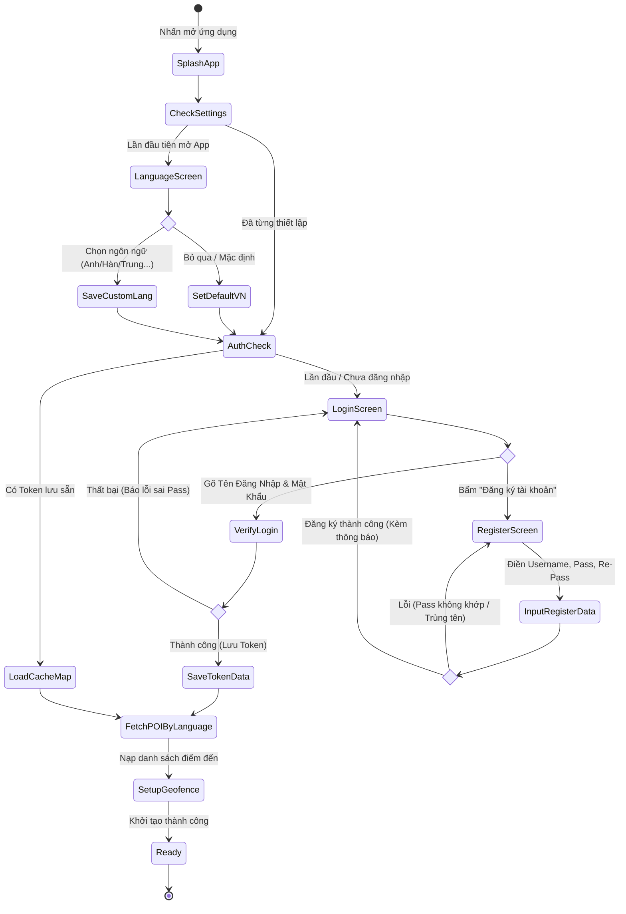
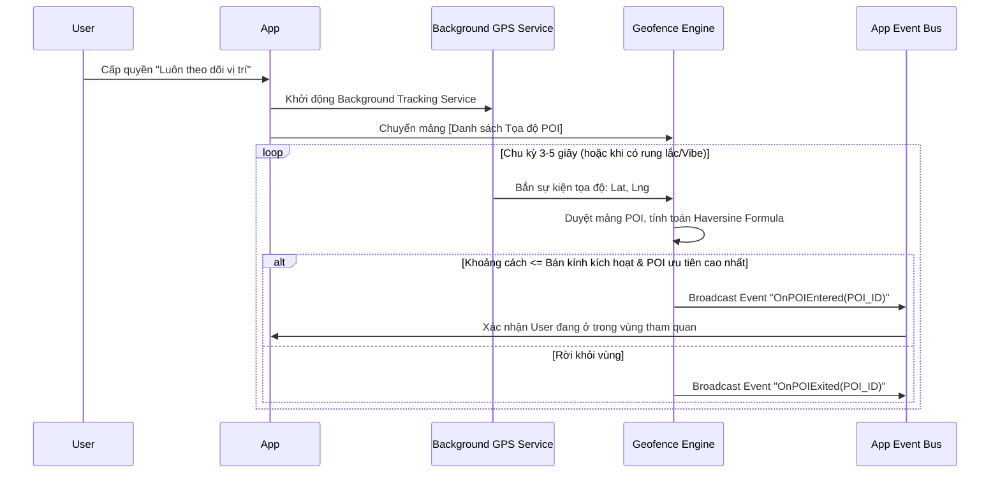
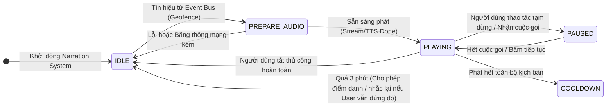
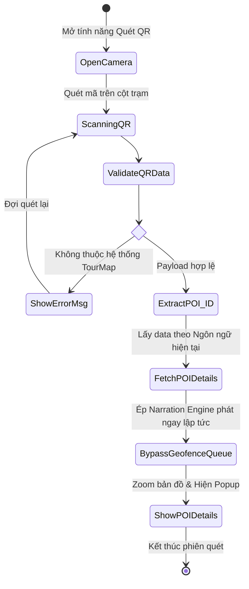
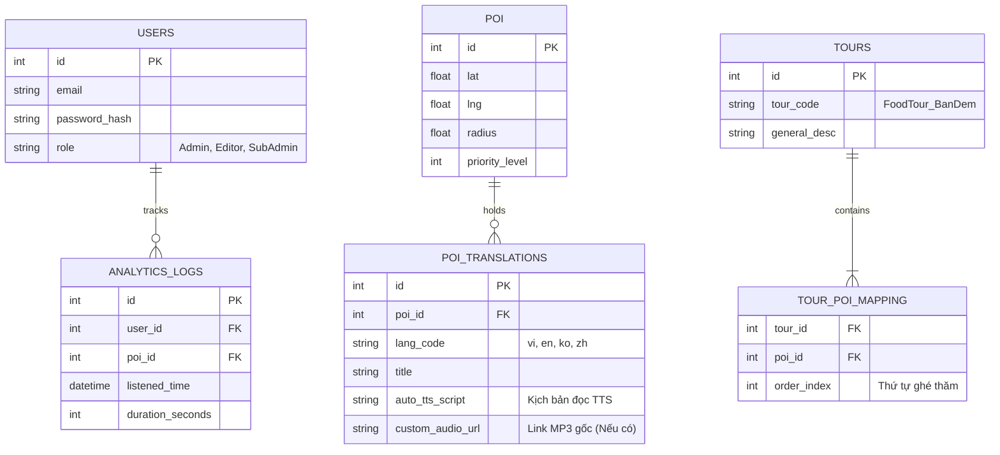
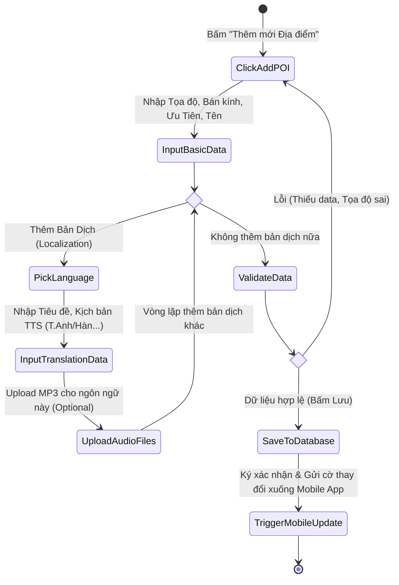
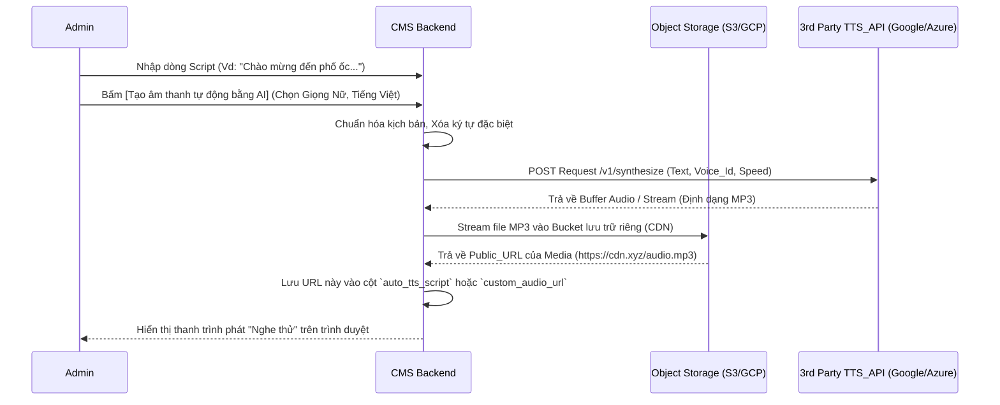
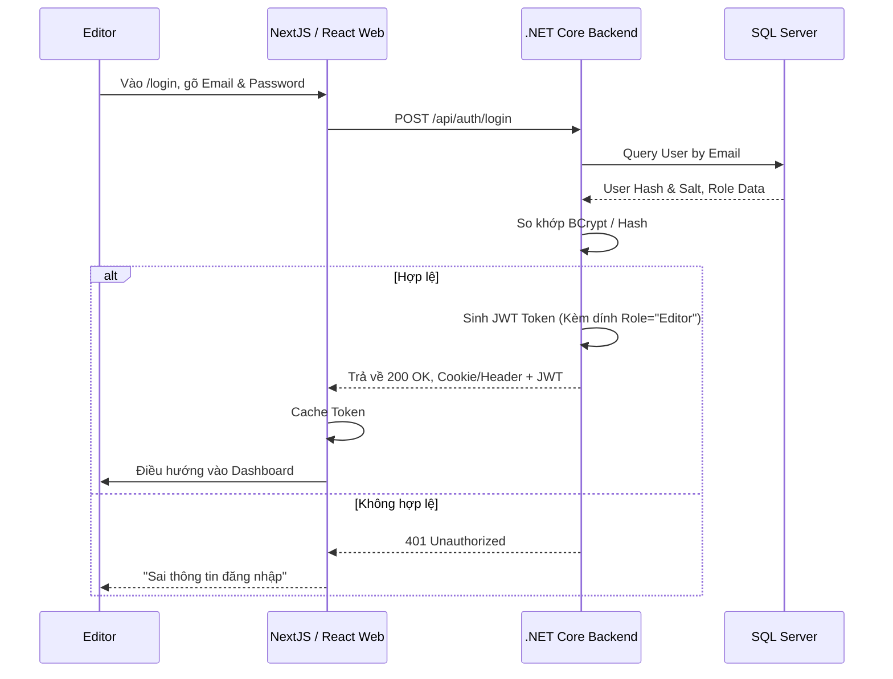

# 🗺️ Tổng hợp Biểu đồ Hệ thống TourMap / Culinary Tourism

Tài liệu này cung cấp cái nhìn chi tiết nhất về luồng dữ liệu, thao tác và vòng đời của từng tính năng độc lập trong cả hai hệ thống: **Khách hàng (Mobile App)** và **Quản trị viên (Admin CMS)**.

---

## PHẦN I: HỆ THỐNG KHÁCH HÀNG (MOBILE APP)

### 1. Chức năng: Khởi động, Đăng nhập & Chọn ngôn ngữ
**Biểu đồ: Sơ đồ hoạt động (Activity Diagram)**  
Mô tả toàn cảnh 1 người dùng từ lúc bấm logo ứng dụng tới lúc họ tải thành công ứng dụng với ngôn ngữ do họ chọn.

### 2. Chức năng: Định vị Nhận diện Điểm đến (Geofencing GPS)
**Biểu đồ: Sơ đồ tuần tự (Sequence Diagram)**  
Chức năng cốt lõi theo dõi GPS người dùng, bao gồm cả khi chuyển App xuống chạy ngầm (Background Tracking).

### 3. Chức năng: Phát âm thanh Thuyết minh tự động (Narration & Queue)
**Biểu đồ: Sơ đồ trạng thái (State Diagram)**  
Mô tả "Động cơ" xử lý âm thanh tự động, cách hệ thống tránh làm phiền khách hàng với cơ chế Cooldown (Chống Spam).

### 4. Chức năng: Quét mã QR tại trạm (Trạm dừng xe buýt Phường / Điểm tĩnh)
**Biểu đồ: Sơ đồ hoạt động (Activity Diagram)**  
Hỗ trợ du khách lười đi bộ, chỉ cần lấy máy quét mã QR gắn ngoài cột chờ xe buýt để nghe tích tắc.

---

## PHẦN II: HỆ THỐNG QUẢN TRỊ (ADMIN CMS WEB)

### 1. Kiến trúc Dữ liệu Đa ngôn ngữ (Database ERD - Entity Relationship)
**Biểu đồ: Thực Thể Ràng Buộc**  
Thiết kế dữ liệu cốt lõi phân rã sự đa ngôn ngữ thông qua bảng `POI_TRANSLATIONS`.

### 2. Chức năng: Quản lý Điểm đến (POI CRUD Lifecycle)
**Biểu đồ: Sơ đồ hoạt động cho Editor nhập liệu**  
Mô tả Editor tạo 1 điểm tham quan ẩm thực mới (Vd: Quán Ốc Vũ).

### 3. Chức năng: Quản lý & Tích hợp AI Text-To-Speech (Media Engine)
**Biểu đồ: Sơ đồ tuần tự tương tác Cloud AI**  
Mô tả Admin thay vì thu âm, họ chỉ việc nhập chữ, Backend sẽ nhờ AI sinh ra file Audio lưu lại tự động.

### 4. Chức năng: Đăng nhập CMS & Phân quyền Hệ thống (Auth)
**Biểu đồ: Sơ đồ tuần tự**  
Thao tác Auth chặt chẽ bằng Role-based Access Control.

